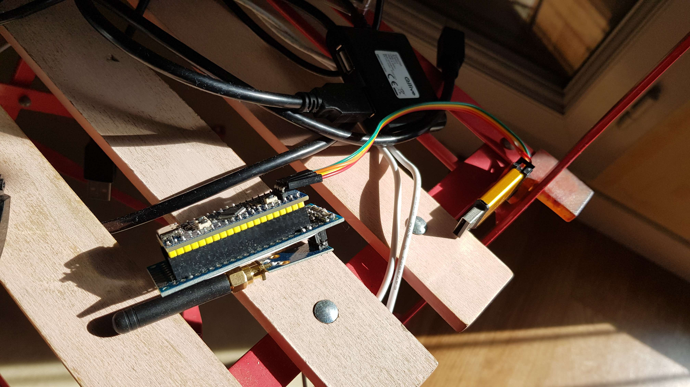

# freedom_tranceiver433



## Installation

### Build

```bash
make
```

### Flashing

Make sure to have OpenOCD installed and your STLinkv2 plugged in.

```bash
make flash
```

## Documentation (french)

- [Part 1](./doc/radio_analysis/part1_fr.md)
- [Part 2](./doc/developpment/part2_fr.md)
