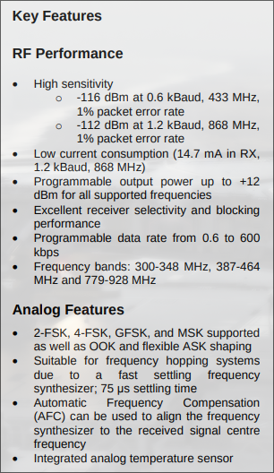

# Partie 2: Developpement d'un bruteforceur de cle de garage

## 1. Le materiel

Bruteforcer une cle de garage revient a refaire sa propre telecommande custom.
Pour cela on a besoin de quoi envoyer un message par radio, soit une antenne et une baseband qui la pilote.
Pour cet outil je veux pouvoir toucher un maximum de télécommande a faible cout, j'ai donc choisi la baseband de Texas Instrument C1101.
Cet outil est capable d'emettre a differentes frequences sub-GHz, en un bon nombre de modulations differentes, comme expliquer dans sa documentation.
En ce qui concerne les achats, pour rester sur du prototypage, on peu prendre n'importe quel module comprenant deja ce transmetteur, son antenne, ses composants exterieurs necessaires a son bon fonctionnement et de quoi connecter un bus SPI, pour a peine quelques euros en ligne.



Cette meme documentation nous dit aussi que ce transmetteur est configurable via un certain nombres de registres accessible en lecture et lecture via un bus SPI.
Nous avons donc besoin d'un microcontrôleur capable de communiquer sur ce type de bus pour piloter notre transmetteur TI CC1101.
Presques tous les microcontrôleurs en sont capable. Mon choix s'est porte sur 3 paramettres: ce que j'avais sous la main de moins chere et de plus rapide.
Ce n'est pas necessaire et je n'en parlerais pas dans cet article, mais je me reserve cependant la possibilite de communiquer avec un PC via une liaison serie.
De maniere generale, l'UART est utilise pour ce type de communication, cependant, comme la majorite des PCs ne sont plus dotes de ports RS232, l'UART necessite souvent un convertisseur UART -> USB en port COM virtuel.
Pour eviter d'utiliser un convertisseur, je choisi un microcontrôleur aussi capable de communication USB directement.
Je suis donc partis sur un STM32F103, qui en plus de tourner a la vitesse respectable de 72MHz, reponds tres bien a toutes ces demandes.
Ce microcontrôleur est facilement accessible en ligne en carte de developpement sous le nom de Bluepill. Je recommande la version de WeAct.


Derniere carte a ne pas oublier si l'on ne n'en possède pas deja, c'est de quoi programmer le microcontrôleur ! Ici le choix est simle, c'est un STLinkV2.
N'importe lequel en ligne fait l'affaire.

Une fois recus et assemble, le miens ressemble a quelque chose comme cela:


## 2. Toolchain

La toolchain de developpement sur microcontrôleur possède quelques particularites mais reste globalement similaire a une toolchain classique.
On a besoin de 4 differents elements.

- Un editeur de texte bien sur
- Un compilateur
- Un debugger
- Une Interface pour le programmer / debugger physique

Il existe plusieurs outils differents, voici ceux que j'utilise.

Le microcontrôleur choisi est un microcontrôleur ARM Cortex M3.
Pour l'editeur de texte j'utilise neovim.
Pour le compilateur et debugger, on utilise les outils classique ARM que sont la suite de la ARM GNU toolchain.
Pour l'interface du debugger physique, il faut en choisir un outil capable de s'interfacer avec notre STLinkV2. STMicroelectronics propose son propre outil, j'ai cependant l'habitude d'OpenOCD et ce dernier possede une configuration pour le stlinkv2. Je le choisi donc.

Tout cela suffit, cependant STMicroelectronics propose un autre outil qui s'avere tres pratique pour faire de rapides prototypes, STM32CubeMX.
Cet outil graphique dedie a la famille des microcontrôleurs STM32, permet de facilement obtenir de la documentation, mais permet surtout d'auto-generer du code a l'aide des differentes librairies proposes par STMicroelectronics.
Je m'en sert pour rapidement creer un projet et auto generer son Makefile, puis pour importer les librairies dont je vais me servir.

Pour resumer:

| Editeur | Complilateur        | Debugger          | Interface     | Bonus         |
|---------|---------------------|-------------------|---------------|---------------|
| NeoVim  | arm-none-eabi-gcc   | arm-none-eabi-gdb | OpenOCD       | STM32CubeMX   |


## 3. Developpement

### Comment interagir avec un microcontrôleur ?

Pour les non-inities, voici un tres rapide resumer des concepts qu'il faut savoir pour comprendre comment interagir avec un microcontrôleur.

#### Memory mapped I/O
Le gros de des interractions se font via les registres du microcontrôleur, accessible via ce que l'on appel du "memory mapped I/O".
Pour une fonctionalite hardware du microcontrôleur, un ou plusieurs registres y est associe, et une addresse est associe a ce registre.
On retrouve le mapping dans la documentation:


Ainsi, si l'on souhaites par exemple allume une LED, on la connecte sur une pin dite GPIO (General Purpose Input Output) du microcontrôleur, et a sa masse.
Il ne suffit ensuite plus que de communiquer au microcontrôleur via ses registres que l'on souhaite mettre cette pin en mode output, et la mettre a l'etat haut, soit 3,3V dans notre cas.

Les GPIOs sont ranges par ports de 16 pins chacuns, pour permettre un registre de 2 octets par port.
Prenons l'exemple de la pin 3 du port A.
Pour mettre notre pin en mode output, on cherche dans la documentation le registre de configuration de cette derniere.


On cherche donc l'addresse a laquelle est mappe ce registre.


Ce qui nous donne l'addresse suivante.

```c
#define GPIOA_base 0x0x40010800
#define GPIO_CRL_offset 0x00

#define GPIOA_CRL (*(GPIOA_base + GPIOA_CRL_offset))

#define GPIO_CRL_MODE3 0b00000000 00000000
#define GPIO_CRL_CNF3 0b00000000 00000000
```

Si l'on souhaite mettre la pin3 en mode output, cet documentation nous demande donc de mettre les bits du registre GPIO_CR 12 a 13 (MODE3) a une valeure superieure a 0, et les bits 14 a 15 (CNF3) a 0b00, soit en mode push-pull (ce qui relie la pin a l'alimentaion Vdd).

```c
GPIOA_CRL |= GPIO_CRL_MODE3;
GPIOA_CRL &= ~(GPIO_CRL_CNF3);
```

Il ne reste ensuite qu'a mettre la pin a l'etat haut.
La documentation nous montre 2 facons pour faire cela.
Une premiere permet de controler d'un coup l'integralite des pins du port.


Puis une seconde qui permet de controler chaque pin individuellement.


On met donc la pin a l'etat haut.

```c
GPIOA_BSRR = GPIO_BSRR_BS3;
```

#### Horloge


#### Interruptions


### Initialisation du projet

Pour initialiser le projet, nous avons besoin globalement de 4 choses:

- Un loader script qui nous permettra de mapper nos differentes sections en memoire a des adresses definit par le constructeur du microcontrôleur.
- Un startup code pour initialiser le microcontrôleur.
- Un Makefile pour facilite le build.
- Des headers definissant des les addresses des registres du microcontrôleur pour grandement facilite la lecture du code (dans le cas d'un microcontrôleur ARM, le constructeur doit ajouter ces definitions dans le CMSIS, il suffit donc de les importer).

Tout cela peu se faire a la main et il est meme recommande de le faire. Cependant, pour un simple prototype, nous pouvons utiliser un outil propose par le constructeur du microcontrôleur: STM32CubeMX.
 L'outil nous permettra aussi d'importer les definitions CMSIS et les librairies faites par STMicroelectronics.

### SPI

### CC1101 Driver
TI tool

### Bruteforcer
