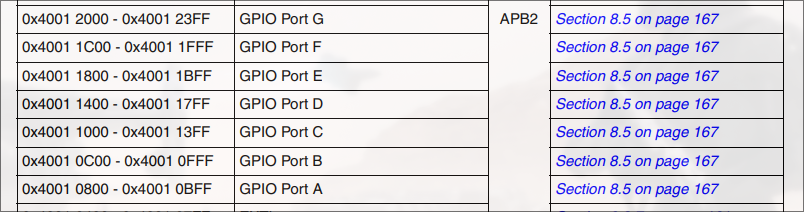

# Partie 2: Developpement d'un bruteforceur de cle de garage

## 1. Le materiel

Bruteforcer une cle de garage revient a refaire sa propre telecommande de portail.
Pour cela on a besoin de quoi envoyer un message par radio, soit une antenne et une baseband qui la pilote.
Pour cet outil je veux pouvoir toucher un maximum de télécommande a faible cout, la baseband de Texas Instrument C1101 fera l'affaire.
Cet outil est capable d'emettre a differentes frequences sub-GHz, en un bon nombre de modulations differentes, comme expliquer dans sa documentation.
En ce qui concerne les achats, pour rester sur du prototypage, on peu prendre n'importe quel module comprenant deja ce transmetteur, son antenne, ses composants exterieurs necessaires a son bon fonctionnement et de quoi connecter un bus SPI, pour a peine quelques euros en ligne.


La documentation nous dit que ce transmetteur est configurable via un certain nombres de registres accessible en lecture et ecriture via un bus SPI.
Nous avons donc besoin d'un microcontrôleur capable de communiquer sur ce type de bus pour piloter notre transmetteur TI CC1101.
Presques tous les microcontrôleurs en sont capable. Ici, nous verrons l'utilisatiom du STM32F103.
Ce n'est pas necessaire et je n'en parlerais pas dans cet article, mais je me reserve cependant la possibilite de communiquer avec un PC via une liaison serie.
De maniere generale, l'UART est utilise pour ce type de communication, cependant, comme la majorite des PCs ne sont plus dotes de ports RS232, l'UART necessite souvent un convertisseur UART -> USB en port COM virtuel.
Pour eviter d'utiliser un convertisseur, il est possible d'utiliser un microcontrôleur capable de communication USB, et d'en faire un device de classe CDC pour le connecter a un PC via le port USB directement. le STM32F103 en est capable.
Ce microcontrôleur est facilement accessible en carte de developpement sous le nom de Bluepill. Je recommande la version de WeAct.


Derniere carte a ne pas oublier si l'on ne n'en possède pas deja, c'est de quoi programmer le microcontrôleur ! Ici le choix est simle, c'est un STLinkV2.
N'importe lequel en ligne fait l'affaire.

Une fois assemble, le montage ressemble a quelque chose comme cela:


## 2. Toolchain

La toolchain de developpement sur microcontrôleur possède quelques particularites mais reste globalement similaire a une toolchain classique.
On a besoin de 4 differents elements.

- Un editeur de texte bien sur
- Un compilateur
- Un debugger
- Une Interface pour le programmer / debugger physique

Il existe plusieurs outils differents, voici ceux que j'utilise.

Pour l'editeur de texte j'utilise neovim.
Le microcontrôleur choisi est un microcontrôleur ARM Cortex M3.
Pour le compilateur et debugger, on utilise les outils classique ARM que sont la suite de la ARM GNU toolchain.
Pour l'interface du debugger physique, il faut en choisir un outil capable de s'interfacer avec notre STLinkV2. STMicroelectronics propose son propre outil, j'ai cependant l'habitude d'OpenOCD et ce dernier possede une configuration pour le stlinkv2.

Tout cela suffit, cependant STMicroelectronics propose un autre outil qui s'avere tres pratique pour faire de rapides prototypes, STM32CubeMX.
Cet outil graphique dedie a la famille des microcontrôleurs STM32, permet de facilement obtenir de la documentation, et de generer du code a l'aide des differentes librairies proposes par STMicroelectronics.
J'ai tendance a m'en servir pour rapidement creer un projet et generer son Makefile, puis pour importer les librairies dont je vais me servir.

Pour resumer:

| Editeur | Complilateur      | Debugger          | Interface | Bonus       |
| ------- | ----------------- | ----------------- | --------- | ----------- |
| NeoVim  | arm-none-eabi-gcc | arm-none-eabi-gdb | OpenOCD   | STM32CubeMX |

## 3. Developpement

### Comment interagir avec un microcontrôleur ?

Pour les non-inities, voici un tres rapide resumer des concepts qu'il faut savoir pour comprendre comment interagir avec un microcontrôleur.

#### Memory mapped I/O

Le gros de des interractions se font via les registres du microcontrôleur, accessible via ce que l'on appel du "memory mapped I/O".
Pour une fonctionalite hardware du microcontrôleur, un ou plusieurs registres y est associe, et une addresse est associe a ce registre.
On retrouve le mapping dans la documentation:


Ainsi, si l'on souhaites par exemple allume une LED, on la connecte sur une pin dite GPIO (General Purpose Input Output) du microcontrôleur, et a sa masse.
Il ne suffit ensuite plus que de programmer les registres qui permettent de mettre cette pin en mode output, et la mettre a l'etat haut, soit 3,3V dans notre cas.

Les GPIOs du STM32F103 sont ranges par ports de 16 pins chacuns, pour permettre un registre de 2 octets par port.
Prenons l'exemple de la pin 3 du port A.
Pour mettre notre pin en mode output, on cherche dans la documentation le registre de configuration de cette derniere.


On cherche donc l'addresse a laquelle est mappe ce registre.




Ce qui nous donne les valeures suivante.

```c
#define GPIOA_base 0x0x40010800
#define GPIO_CRL_offset 0x00

#define GPIOA_CRL (*(GPIOA_base + GPIOA_CRL_offset))

#define GPIO_CRL_MODE3 (0b11 << 12)
#define GPIO_CRL_CNF3 (0b11 << 14)
```

Si l'on souhaite mettre la pin3 en mode output, cet documentation nous demande donc de mettre les bits du registre GPIO_CR 12 a 13 (MODE3) a une valeure superieure a 0, et les bits 14 a 15 (CNF3) a 0b00, soit en mode push-pull (ce qui relie la pin a l'alimentaion Vdd).

```c
GPIOA_CRL |= GPIO_CRL_MODE3;
GPIOA_CRL &= ~(GPIO_CRL_CNF3);
```

Il ne reste ensuite qu'a mettre la pin a l'etat haut.
La documentation nous montre 2 facons pour faire cela.
Une premiere permet de controler d'un coup l'integralite des pins du port.


Puis une seconde qui permet de controler chaque pin individuellement.


On met donc la pin a l'etat haut.

```c
GPIOA_BSRR = GPIO_BSRR_BS3;
```

Fort heureusement la majorite des vendeurs mettent a disposition des headers definissant ces registres et leurs addresses, ainsi que des librairies pour facilement interagir avec.

#### Horloge

Un autre point important a comprendre afin d'eviter des heures de debug inutiles, c'est le principe d'horloges.
En electronique numerique, une horloge est un composant qui genere un signal carre a frequence fix, permettant de cadencer les differents modules de logique numerique, la frequence du signal d'horloge principal defini la frequence de calcul effective du processeseur ou microcontroleur.

Il existe plusieurs types d'horloges, les performances de ces dernieres sont principalement mesures sur deux facteurs, leur vitesse et leur precisions. En generale, pour un meme prix, une horloge plus rapide sera moins precise et inversement.

Les microcontroleur possede en generale une horloge interne, mais propose aussi la possiblite de l'ameliorer avec une ou plusieurs horloges externes.
La BluePill possede un resonateur a crystal servant d'horloge externe haute vitesse (HSE, pour High Speed External), ces horloges sont rapident mais moins precise que certaines horloges plus lente, mais faite pour la precision.
Dans notre cas cette horloge conviendra tres bien.

Depuis tout a l'heure je ne parle que d'une seule source de signal d'horloge, mais en realite, les microcontroleurs modernes permettent de diviser ce seul signal d'horloge en plusieurs sources differentes.
Les differents bloques logiques composants le microcontroleur sont de fait diviser en plusieurs groupes, chacuns cadences a des frequences differentes, et paramettrables.
Cette separation est faite dans le but de permettre au developpeur de limiter la consomation de courant du microcontroleur en limitant voir desactivant les groupes qui sont moins ou pas utiles.
Sur les STM32, chaque horloge de bus est d'ailleur desactivee par defaut, rendant inoperant l'integralite des modules presents sur ce bus, ce qui leur permet de ne pas consommer de courant, mais force le developpeur a s'assurer d'avoir bien active l'horloge du bus sur lequel est connecte le module qu'il souhaite utiliser.
Chacuns de ces groupes sont relies a leur source d'horloge, et au coeur Cortex M3 dans notre cas, par le biais de bus de donnees.
Ces groupements sont definis dans la documentation du microcontroleur.


APB1 et APB2 sont ici 2 exemples de ces bus de donnees possedant une horloge chacuns.
Concretement, on voit dans ce schema que si nous souhaitons active une pin GPIO du port A comme vu precedemment, il est important de s'assurer que l'horloge du bus APB2 est activee et parametree.

Afin de parametrer la frequence de ces horloge a partir de l'horloge source, les constructeurs de nos microcontroleurs on integres 2 composants differents:

- Des PLL (Phase Lock Loop, ou Boucle a Verouillage de Phase, si certains d'entre vous se souvient de vos cours d'electronique) qui permettent multiplier la frequence du signal d'horloge par multiples de 2.
- Avec par exemple un groupe de 2 D flip-flops, il est possible de diviser la frequence de notre signal carre par multiples de deux. On appel cela un prescaler.

Nous somme donc limites a 2 operations sur notre horloge source, des multiplications et des divisions par multiples de deux.
Afin de determiner les valeures que nous souhaitons donne a ces prescalers et PLLs, un arbre representant les emplacement de ces derniers nous ai donne dans la documentation.


On retrouve dans ce schema l'horloge principal, nommee ici AHB, depuis laquelle les horloges cadencant nos bus sont derivees.
Cette horloge principale peu etre source via differentes horloges, soit les horloges rapides ou lentes internes (HSI, LSI), soit les horloges rapides ou lentes externes qui doivent donc etre rajouter sur le PCB, generalemt assez proche du microcontroleur (HSE, LSE).
On voit d'ailleurs sur ce schema que notre microcontroleur ne peut pas etre cadencer a plus de 72MHz, car c'est la valeure maximale supporte par l'horloge principale, et il n'y a aucune PLL apres cette horloge. Chacuns des bus ne peu donc etre que plus faible que cette valeure.

Chacunes de ces valeures prescalers et PLL, ainsi que l'activation ou non de chaque horloge, sont paramettrables en modifiant leurs registres associes, suivant le principe de memory mapped I/O, comme vu precedemment.
Bien que ces valeures soient configurable a la main, nous verrons une facons de calculer automatiquement ces dernieres en fonction d'une frequence de sortie cible.

### Initialisation du projet

Si vous avez compris cela, vous avez les bases minimums pour developper ce projet a l'aide du logiciel STM32CubeMX.

Pour initialiser le projet, nous avons besoin globalement de 4 choses:

- Un loader script qui nous permettra de mapper nos differentes sections en memoire a des adresses definit par le constructeur du microcontrôleur.
- Un startup code pour initialiser le microcontrôleur.
- Un Makefile pour facilite le build.
- Des headers definissant des les addresses des registres du microcontrôleur pour grandement facilite la lecture du code (dans le cas d'un microcontrôleur ARM, le constructeur doit ajouter ces definitions dans le CMSIS, il suffit donc de les importer).

Tout cela peu se faire a la main et il est meme preferable de le faire soi meme. Cependant, pour un simple prototype, nous pouvons utiliser un outil propose par le constructeur du microcontrôleur: STM32CubeMX.
L'outil nous permettra aussi d'importer les definitions CMSIS et les librairies faites par STMicroelectronics.

#### Initialisation via STM32CubeMX

Pour resumer ce dont nous avons besoin qu'STM32CubeMX nous generer:

- Un Makefile
- Le startup code
- Les definitions CMSIS
- La configuration des differentes horloges
- Les librairies SPI

La premiere chose STM32CubeMX a besoin est de savoir sur quel microcontroleur nous travaillons.
On selectionne donc en premier notre STM32F103.


Une fois selectionne, la premiere chose a faire est de configurer le bus de debug que l'on va utiliser. Ici, on utilise le protocole SWD (Serial Wire Debug)


Ensuite, c'est au tour de la configuration des horloges.
En electronique numerique, une horloge est un composant qui genere un signal carre a frequence fix.
Le STM32F103 possede sa propre horloge interne. Cepdandant, cette derniere est lente et peut etre ameliorer avec une horloge externe.
La BluePill possede un resonateur crystal servant d'horloge externe haute vitesse.
Ces horloges sont rapident mais moins precise que certaines horloges plus lente, mais faite pour la precision.
Dans notre cas cette horloge convient tres bien.

On commence par donc prevenir le logiciel que nous utiliserons cette derniere.


Ensuite seulement, il est possible de configurer les frequences des horloge cadencant les differents bus de notre microcontroleur.
En effet, je parlait de composants pour definir les horloges, mais, en realite, il est possible de diviser en signal en plusieurs frequences differentes a l'aide de differents circuits.

- A l'aide par exemple de 2 D flip-flops, il est possible de diviser la frequence de notre signal carre par multiples de deux.
  On appel cela un prescaler.
- A l'aide de PLL (Phase Lock Loop, ou Boucle a Verouillage de Phase, si certains d'entre vous se souvient de vos cours d'electronique) il est possible de multiplier la frequence du signal d'horloge par multiples de 2.


### CC1101 Driver

#### SPI

### TI tool

### Bruteforcer
