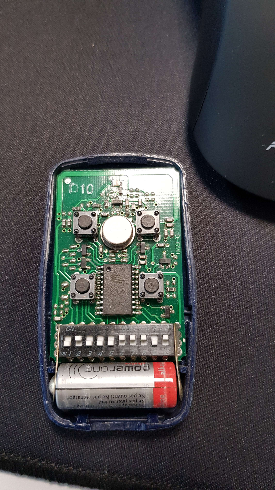
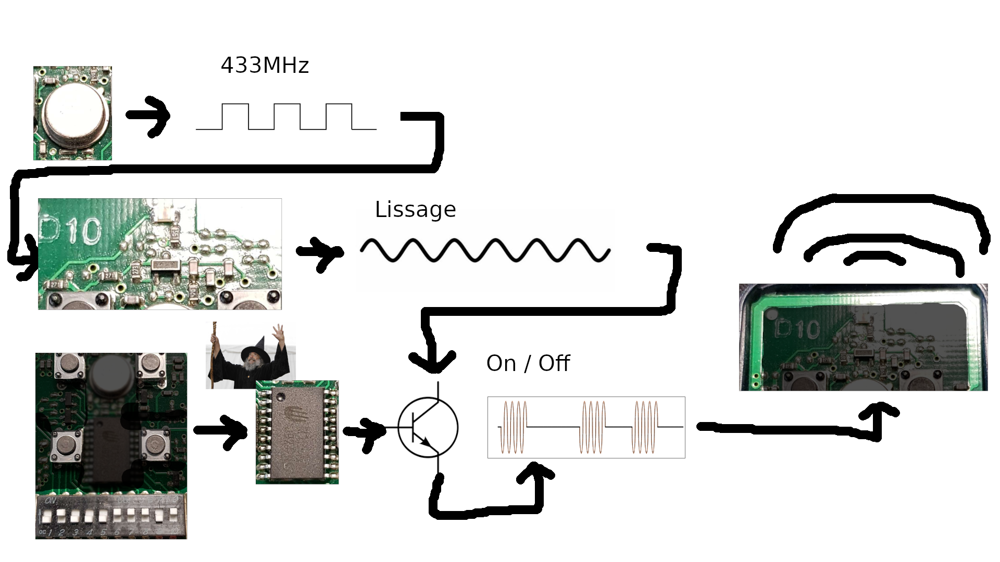
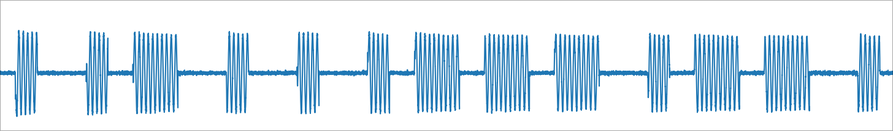
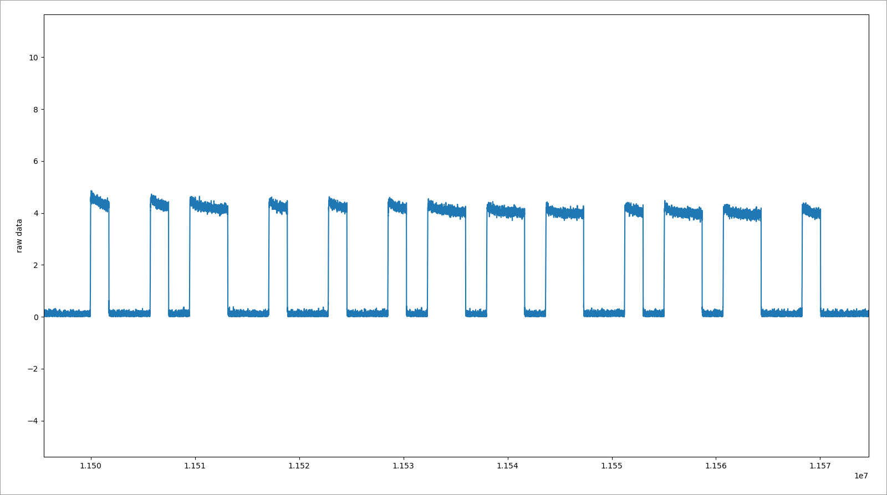
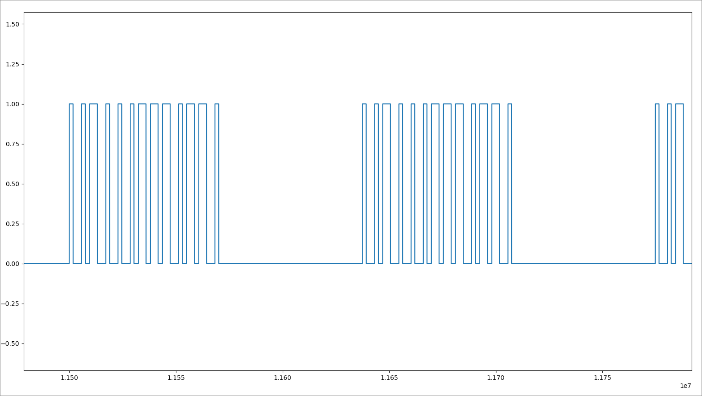
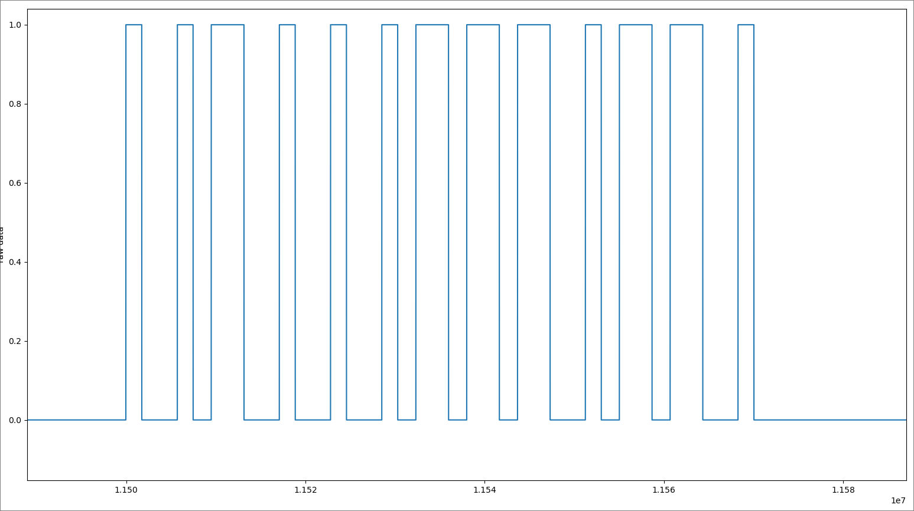
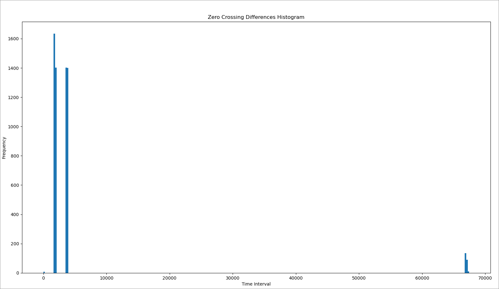
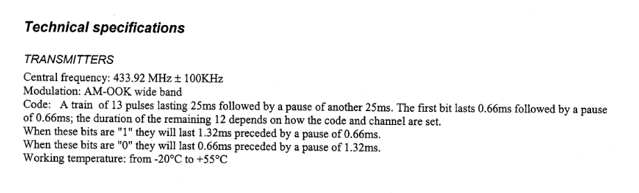

# Partie 1: Une clé de garage, comment ça fonctionne ?

## 1. Prémices

Sous le ciel pluvieux de décembre, je chevauchais mon fidèle destrier à deux roues après une journée de labeur. Les gouttes de pluie martelaient mon casque tel un défi lancé par la nature elle-même. Enfin devant mon sanctuaire, le portail de garage se dressait majestueusement. Pressant avec confiance le bouton de la télécommande, j'attendais la danse mécanique qui allait me permettre de mettre ma monture à l'abri. Cependant, dans l'obscurité de la nuit, le silence s'installa. Aucune réponse, aucune obéissance. Mon portail, habituellement docile, avait décidé ce soir-là de défier son maître. Il semblait que dans le crépuscule humide, mon portail se dressait en symbole de résistance, déclarant une guerre sourde mais intense.

"Est de soumettre l'ennemi sans combat", disait Sun Tzu.
Cependant, ce soir-là, mon portail avait décidé de renverser la stratégie, me forçant à élaborer une tactique pour reconquérir mon propre domaine.

## 2. La télécommande

Le lendemain, je mettais en œuvre la première étape de mon plan : la reconnaissance de l'ennemi.

J'ouvris donc la télécommande.



La première chose qui me sauta aux yeux fut le constat que la pile s'était délogée de son emplacement. Un détail cependant certainement insignifiant, que j'ai décidé d'ignorer.

Plus intéressant cependant, sont les différentes composantes du circuit imprimé. On note 6 principaux composantes :

- Quatre boutons poussoirs utilisés pour choisir parmi les différents portails de ma résidence.
- Une suite de dix switchs.
- Un microcontrôleur ayant l'air très basique.
- Un oscillateur à quartz cadencé à 433MHz.
- Une antenne faisant le tour du haut circuit.
- Un ensemble de composants résistifs, capacitifs et inductifs en entrée de l'antenne.

Le circuit semble centré autour du microcontrôleur. Tous les composants cités y sont reliés.

On imagine assez facilement que tous les boutons, une fois combinés, forment le message envoyé par la télécommande.

Au vu de la simplicité du microcontrôleur, je doute fortement que ce dernier ait besoin d'être cadencé à 433MHz. Sachant que cette fréquence est très souvent utilisée comme fréquence de porteuse en radio, on imagine plutôt que ce dernier fournit un signal carré qui, une fois filtré correctement par le paquet de composants situé entre lui et l'antenne, fournit la porteuse sinusoïdale de 433MHz qui module le signal.

En fait, ce circuit ressemble fortement à un circuit basique de transmetteur radio modulé en OOK (On / Off Keying). Ou la porteuse, comme expliqué précédemment, est coupée via un transistor piloté par le microcontrôleur. Ce dernier code le message à envoyer et l'envoie à un baud rate prédéfini en coupant ou non le signal (On / Off) de la porteuse.

C'est un type de circuit très simple, peu coûteux et qui fonctionne bien.

Voici donc un schéma paint de qualité, montrant, à ce stade, comment j'imagine le fonctionnement de cette clé :




L'ordre d'interaction des composants est certainement faux, mais ce n'est pas très important. J'ai préféré utiliser cet ordre pour simplifier le schéma. Le transistor est très probablement positionné en contrôle de l'alimentation de l'oscillateur, pour éviter une consommation de courant inutile lorsque le signal est en position Off.

Un message radio se doit d'être encodé pour réduire les erreurs à la réception. C'est le microcontrôleur qui semble gérer cela.
Vu la simplicité du circuit, l'encodage l'est surement tout autant. En effet, presque tous les microcontrôleurs possèdent la capacité d'offrir une sortie PWM (Pulse Width Modulation), permettant de générer un signal carré dont la largeur est variable. Cette fonctionnalité est souvent utilisée par les constructeurs de télécommandes de garage en raison de sa simplicité et de son faible coût de développement. Cela semble cohérent avec la philosophie actuelle du circuit, je m'attends donc à le retrouver ici, même si, à l'heure actuelle, ce n'est qu'une supposition.

En résumé, on a de la chance, le circuit semble simle. L'hypothèse actuelle est la suivante :
La télécommande envoie un message comprenant un code long de 10 bits et une information sur lequel des 4 boutons est pressé. Ce message serait modulé en OOK et probablement encodé en PWM. Je ne connais pas de moyen de deviner le baud rate à ce stade de l'analyse.


## 3. Analyse radio

Il est temps de vérifier tout cela.

### Acquisition du signal

On s'équipe d'un BladeRF pour capter le signal de la télécommande.

On s'assure premièrement de la fréquence à laquelle le signal est modulé.
Pour cela, on peu utiliser Gnuradio. Rien de plus simple :
On utilise le bloc OsmoSDR pour s'interfacer avec le BladeRF, on rend la fréquence variable, on affiche le plot en cascade, et on fait varier la frequence jusqu'a voir le signal.
Le signal apparaît a 433MHz, on confirme la fréquence.

On amplifie, centre, et filtre le signal en utilisant un bloc Multiply et un bloc Frequency Translating FIR Filter. Ensuite, on ajoute un bloc File Sink pour enregistrer le signal au format complexe et débuter son analyse.

On affiche l'enregistrement pour en avoir un premier aperçu.

```python
raw_data = np.fromfile("signal.raw", dtype="complex64")
plt.plot(raw_data)
plt.show()
```



Plus de doute, le signal est très clairement modulé en OOK (On-Off Keying).
L'OOK est le type de modulation le plus facile à démoduler qui existe ! Il suffit de ne garder que les valeurs absolues du signal.

```python
def OOK_demod(signal):
    return np.abs(signal)
```




Pour faciliter l'analyse de ce signal, j'aime travailler sur des valeurs binaires. Je transforme donc le signal en un signal carré dont l'amplitude varie entre 0 et 1.

```python
def trigger(signal, trig):
    max_signal = max(signal)
    trig_const = max_signal * trig
    trim = lambda x: x >= trig_const
    return np.array([trim(i) for i in signal])

```



### Analyse du signal

Nous voilà maintenant avec un signal propre, nous pouvons commencer l'analyse.



Tout d'abord, rappelons ce que l'on recherche lorsque l'on essaie de comprendre un signal :

- Sa modulation
- Sa fréquence
- Son baud rate
- Son encodage
- Son protocole d'envoi de données
- En ce qui concerne sa modulation, nous pouvons très bien la voir à l'œil nu, c'est de l'OOK.

Pour la fréquence, nous l'avons vue grâce au plot en cascade, c'est du 433 MHz (433,92 MHz pour être précis).

Au tour du baud rate maintenant.
Une manière simple de trouver le baud rate est de mesurer la durée du plus petit bit que l'on peut trouver sur le signal.

Pour le faire simplement, il suffit de soustraire au signal sa propre moyenne pour le recentrer sur 0, puis de compter l'écart d'échantillons entre chaque croisement du signal avec 0, pour enfin prendre le plus petit compte.
Cette manière de faire possède un souci cependant. Cela sous-entend un signal parfait sans aucun bruit, et bonne chance pour avoir un tel signal.

Pour pallier cela, on met ce tableau de compte d'écart d'échantillons dans un histogramme pour visualiser moi-même quel compte a le plus de chances de correspondre à un bit.
La valeur de l'histogramme la plus petite, qui apparaît le plus souvent, est très probablement notre bit.
Aussi, il y a une autre valeur de cet histogramme qui va nous intéresser. Non pas cette fois la durée la plus courte entre chaque croisement du signal avec 0, mais la plus longue.
Cette valeur correspond à la durée du délai entre chaque message.

```python
def calculate_bit_timing(_signal):
    _signal = np.array(_signal - np.mean(_signal))


    # plt.plot(_signal)
    # plt.show()

    zero_crossings = np.where(np.diff(np.signbit(_signal)))[0]
    differences = np.diff(zero_crossings)

    histogram, bin_edges = np.histogram(differences, bins='auto')

    batches_indexes = get_batches_indexes(histogram)

    bit_timing = bin_edges[batches_indexes[1]]
    # print_histogram(differences)

    return bit_timing, bin_edges[batches_indexes[-1]]
```





Justement, grâce à l'histogramme, on voit que le plus petit compte (la valeur très basse près de 0) est certainement une erreur, étant donné sa très faible fréquence d'apparition. Je considère donc le compte suivant comme étant la durée d'un bit en échantillons, puis le dernier compte comme étant la durée de la pause entre chaque message.

Ce qui nous donne les durées suivantes :

```python
print(f"Bit Timing: {bit_timing} samples | {(bit_timing / sample_rate) * 1000}ms")
print(f"Msg Timing: {msg_timing} samples | {(msg_timing / sample_rate) * 1000}ms")
```
```bash
Bit Timing: 1868.3771626297578 samples | 0.6227923875432526ms
Msg Timing: 67460.0 samples | 22.486666666666665ms
```


1 bit est à peu près égal à 0.62 ms, soit un baud rate de 1/(0.62e-3) = 1613. Le délai entre chaque message est de 22.5 ms.

Il faut garder en mémoire que ce ne sont que des valeurs approximatives qui vont dépendre de la qualité de l'enregistrement du signal et de la valeur de son taux d'échantillonnage.

Bon, il nous reste à connaître l'encodage et le protocole du signal.

En ce qui concerne l'encodage, pas de méthodes magiques, il faut analyser le signal, tout en se servant des informations que l'on connaît déjà, soit les différents boutons et switches dans notre cas.

La première chose qu'on remarque assez facilement, c'est la régularité des motifs observables. En effet, et cela est confirmé par l'histogramme, on voit sur le signal soit 2 ou 1 bit consécutifs, jamais plus. Quand on compare rapidement cela avec le code à 10 chiffres donné par la suite de switches, on retrouve ce code dans son intégralité à partir du second bit, si on considère un 0 comme étant 1 seul bit consécutif, et un 1 comme étant 2 bits consécutifs. Cela ressemble donc en effet fortement à un encodage PWM, où 1 est représenté par '110' et 0, '100'. Seulement, je me rends compte d'une chose, c'est que le décodage ne fonctionne que si l'on inverse les précédents symboles, soit 1 = '011' et 0 = '001'. En appliquant cet encodage, j'arrive à retrouver le code à 10 chiffres, ainsi que deux bits supplémentaires dont j'ignore pour l'instant l'utilité. Pour obtenir ce décodage, j'ai dû ignorer le tout premier bit, que je considère comme étant un bit de préambule (servant à synchroniser l'horloge du récepteur).

Il ne reste plus que le protocole. Et il est assez simple, une bonne partie du travail est déjà faite. On retrouve, entre le premier bit et les 2 derniers, les 10 bits correspondants aux switches de la télécommande. Pour les 2 derniers bits, on imagine bien qu'ils ne sont pas là pour rien, en effet, 2 bits sont tout ce qu'il faut pour coder 4 boutons. Pour vérifier cela, rien de plus simple, je refais des enregistrements avec les différents boutons de la télécommande, et en effet, ces derniers sont les seuls bits qui changent. Pour le premier bit, il est toujours là peu importe si l'on change les switches ou les boutons, donc comme je le disais, je le considère comme étant un bit de préambule.

Pour résumer, cette rapide analyse conclut sur les valeurs suivantes :

- Modulation: OOK
- Fréquence: 433.92 MHz
- Baud rate: À peu près 1613, avec 22.5 ms de délai entre chaque message
- Encodage: PWM avec 1 = '011' et 0 = '001'
- Protocole d'envoi de données: 1 bit de préambule, 10 bits encodés pour le code de la télécommande, 2 bits encodés pour les boutons de la télécommande


## 4. Organismes de regulation

Il est parfois possible d'éviter de faire tout le travail précédent. En effet, afin d'avoir le droit d'être mis en vente, un produit utilisant la radio se doit d'être certifié auprès de l'organisme de régulation de son pays. Afin d'être certifié par ces organismes, le producteur doit leur envoyer des documents décrivant le fonctionnement du produit. Les télécommandes de garage ne font pas exception.

Ce qui est intéressant, c'est que certains de ces organismes rendent ces documents publics si le producteur ne demande pas explicitement de les garder privés. Il est donc parfois intéressant de chercher les produits sur lesquels on travaille sur les sites de ces organismes pour chercher d'éventuels documents sur leur fonctionnement.

Voici une liste non exhaustive de ces organismes :

- ANFR : France
- OFCOM : Angleterre / Suisse
- UFCOM : Italie
- Bundesnetzagentur (j'ai épelé ça correctement ?) : Allemagne
- FCC : États-Unis
- ...

Les États-Unis étant un très gros marché mondial, je cherche généralement en premier sur le site de la FCC. Et j'ai de la chance, car non seulement cette télécommande est présente sur la FCC, mais en plus la plupart de ses documents sont publics. Je trouve notamment ce document qui m'intéresse particulièrement :




On y retrouve toutes les informations utiles. On peut voir que l'analyse n'était pas si loin de la réalité, avec quelques imprécisions au niveau des timings.


## Conclusion

En résumé, notre analyse a révélé les caractéristiques suivantes : 
Nous avons identifié une modulation OOK, une fréquence de 433.92 MHz, un baud rate d'environ 1613, et un encodage PWM.
Le protocole d'envoi de données comprend un bit de préambule, 10 bits pour le code de la télécommande, et 2 bits pour les boutons.
Les informations obtenues ont été precisées et confirmées par des documents de la FCC, et on se servira de ses valeures pour la prochaine partie de l'article.
Soit une correction du baud rate à 1515 et un délai entre chaque message de 25 ms.

Alors, rendez-vous dans la partie 2, où l'on utilisera ces informations pour développer un outil de bruteforce de cette clé de garage pour 10 euros, en bare-metal C sur un microcontrôleur STM32 et un module radio TI CC1101 !
